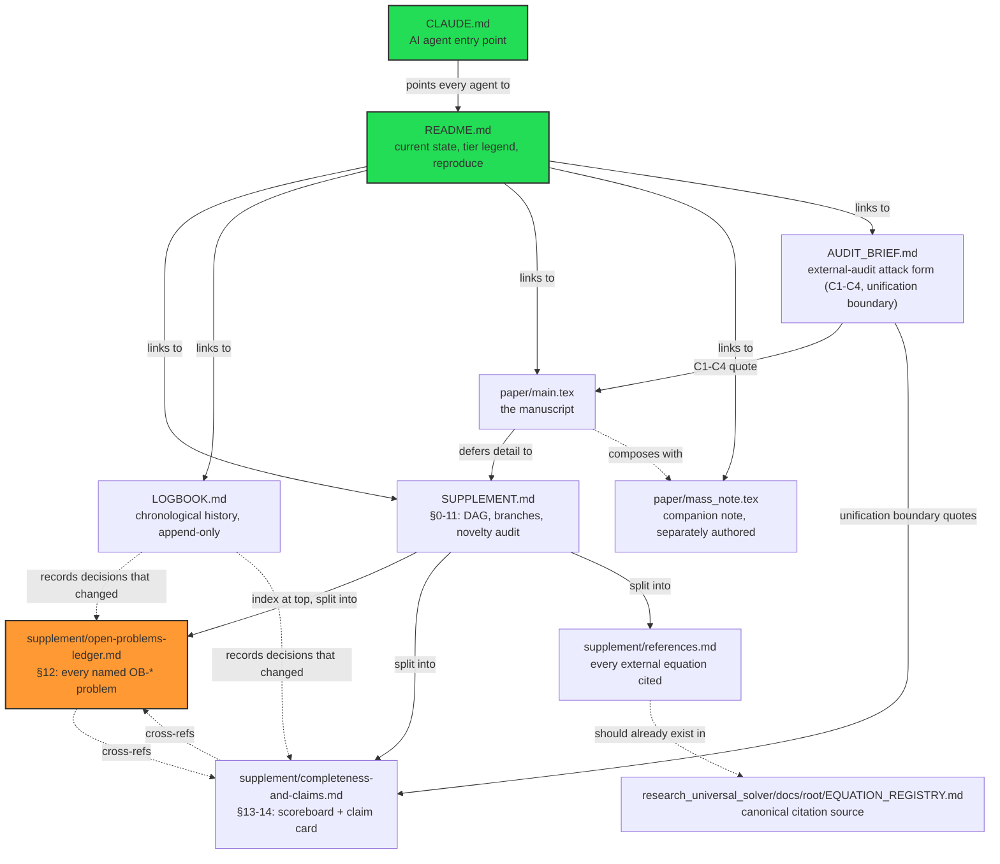

# Knowledge Map — Causal Quantum Gravity

A one-page map of every document in this repo and how they relate, for anyone (human or AI)
opening this repo cold. Not a new source of truth — every fact below is a pointer, not a
restatement; if this map and a linked document ever disagree, the linked document wins.

## Document graph

**Solid arrows** = structural (this document exists because of / is part of that one).
**Dashed arrows** = referential (this document cites or is affected by that one, without
being physically contained in it). The orange node (`open-problems-ledger.md`) is the most
frequently updated document in the whole repo — check there first before starting new work.

## Which document answers which question

| Question | Document |
|---|---|
| "What does this repo claim, at a glance?" | `README.md` |
| "I'm an AI agent, where do I start?" | `CLAUDE.md` |
| "What's the full derivation, branch by branch?" | `SUPPLEMENT.md` §0-11 |
| "Is there already a named open problem for X?" | `supplement/open-problems-ledger.md` |
| "Is the project 'done'? What exactly is missing?" | `supplement/completeness-and-claims.md` §13 |
| "What is this project claiming, and what is it explicitly NOT claiming?" | `supplement/completeness-and-claims.md` §14 |
| "Who owns equation/result X, and when was it published?" | `supplement/references.md` (this repo) + `EQUATION_REGISTRY.md` (canonical, sibling repo) |
| "How did we get here — what worked, what failed, when?" | `LOGBOOK.md` |
| "I want to try to break a specific claim" | `AUDIT_BRIEF.md` |
| "What's the actual theorem-level manuscript?" | `paper/main.tex` |
| "What's the mass-derivation companion argument?" | `paper/mass_note.tex` (do not edit without asking its author) |
| "How do I mechanize a new result and get it into this repo?" | `research_universal_solver`'s own `CLAUDE.md` (sibling private repo — new theorems are born there, synced here after) |

## Standing discipline this map does not override

- Tier discipline (`Th_coqc` / `+reals` / `finite_diagnostic` / `Dr` / `Open`) applies everywhere
  linked above — this map carries no tier itself, it is pure navigation.
- `LOGBOOK.md` is append-only; a stale cross-reference inside an old LOGBOOK entry is
  preserved on purpose, not a map error.
- If a section number cited anywhere (`§12 item 7`, `§13`, etc.) doesn't resolve where you
  expect, check `SUPPLEMENT.md`'s own index first — the split happened 2026-07-06 and old
  citations predating it may say `SUPPLEMENT.md §N` when they now mean one of the three
  `supplement/*.md` files.
