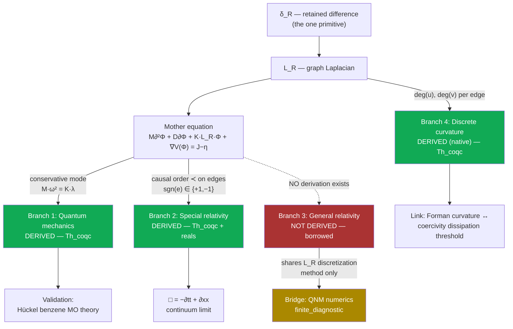

# Supplement: Causal Quantum Gravity

**Companion supplement to the manuscript (`paper/main.tex` / `paper/main.pdf`).
Contains the full dependency DAG, the complete eight-attempt General-Relativity
refutation log, the full novelty audit, and the extended reference-verification
trail. The manuscript is self-contained for the theorem-level claims and the
reproduction commands; this document records the full argument and the audit
process that produced those claims.**

> **Reading guide.** Every claim below carries a tier tag. `Th_coqc` = machine-checked
> in Coq, axiom-free over ℚ (`Print Assumptions` prints "Closed under the global
> context"). `+reals` = Th_coqc but depends on Coq's standard Reals axioms
> (`ClassicalDedekindReals.sig_forall_dec`, `FunctionalExtensionality`), honestly
> disclosed. `finite_diagnostic` = a numerical measurement, reproducible, not a
> proof. `Dr` = an interpretive stance, not machine-checked. `Open` = admitted gap.
> **Never collapse these tiers.** Code blocks marked `coq` below are **pseudo-Coq**
> — simplified for readability; the real, compiling source is cited by file and
> line for every one.


## Index — this document is split into four files

This supplement outgrew a single file (the open-problems ledger alone had
grown past 680 lines, the most frequently-updated section in the whole
project). Reading order below matches the numbering; jump directly to
whichever piece you need.

| File | Contents | Sections |
|---|---|---|
| **`SUPPLEMENT.md`** (this file) | The derivation narrative: dependency DAG, all four branches (QM/GR/curvature), the strengthening campaign, the novelty audit, the tier ledger | §0–§11 |
| **[`supplement/open-problems-ledger.md`](supplement/open-problems-ledger.md)** | Every named open problem (`OB-*`), the eight-attempt GR-refutation log's follow-on ledger, the "method for finding open problems," the three middle-school-physics worked examples, and the reproducibility status table — the most actively updated document in this project | §12, §12.1, §12.2, §12.3 |
| **[`supplement/completeness-and-claims.md`](supplement/completeness-and-claims.md)** | The completeness scoreboard (four levels × QM/GR) and the Unification Claim Card (what is and is not claimed, permanently) | §13, §14 |
| **[`supplement/references.md`](supplement/references.md)** | Every external equation cited in this journal, by branch | References |

**A reader new to this project should still start with `README.md`, then
`CLAUDE.md` if you are an AI agent** — this index is for navigating
*within* the supplement once you're already here, not a replacement for
those entry points.

---

## 0. Abstract

This journal documents one day's work (2026-07-04 → 2026-07-05) attempting to
connect this repository's "mother equation" — a single graph-based PDE — to
quantum mechanics and relativity. The honest result is asymmetric and is
reported as such:

- **Quantum mechanics** is derived from the mother equation at the equation
  level, and the derivation is validated against a real, checkable quantum
  chemistry result (Hückel theory of benzene).
- **Special relativity** (the causal/Lorentzian structure and the
  d'Alembertian wave operator) is *also* derived from the mother equation's
  own causal order, at the equation level. The Coq proofs themselves
  (`InfoLorentz`/`InfoLorentzContinuum`) were authored in an earlier
  session (committed 2026-06-27); what happened *this* session was
  rediscovering their significance for this specific question and
  independently re-verifying their tiers (`Print Assumptions`) — not
  originating the proofs. Corrected here after an adversarial peer review
  (2026-07-05) caught an earlier draft implying same-session discovery.
- **General relativity** (curved continuum spacetime, Schwarzschild, Einstein's
  field equations) is **not** derived anywhere in this codebase, and eight
  independent attempts to derive it during this session were tested and
  refuted or left open. This is argued to be a *correct* outcome, not a
  failure: continuum GR is, by this project's own stated philosophy, a
  **non-readout** (an artifact of injecting actual infinity), so deriving it
  exactly was never the right target.
- In its place, a genuinely **native, discrete "gravity-flavored" object** —
  Forman-Ricci curvature on the graph — is identified, proved to be an
  honest readout of the same graph data the mother equation uses, and linked
  by exact algebraic substitution to an already-proven stability
  (coercivity) theorem.

**Update (2026-07-05, after an independent adversarial referee review):**
responding to the review by proving more, not retreating any claim, two
further blocks of work were added the same day:

- **Unification (§8):** the quantum dispersion relation and the special-
  relativistic wave operator are proved to be *literally the same equation*
  under an exact algebraic reparametrization (a pure `ring` identity, no
  continuum limit) — not two branches sharing a name, one equation with two
  readouts.
- **A six-result strengthening campaign (§9, 44 theorems, all Th_coqc):**
  a real frequency/UV ceiling forced by the graph's own maximum degree; an
  exact "no local creation" energy-balance theorem; a Schrödinger-shaped
  first-order skew-adjoint skeleton; a causal sign-construction theorem
  with an honestly-disclosed partial closure (it does not yet apply to this
  repo's own causal order, which was independently found to be a genuine
  total order); and a discrete Noether theorem (graph automorphism ⟹ exact
  conserved quantity).

---

## 1. The mother equation

```coq
(* the one spine PDE this entire project is built from *)
M ∂²Φ + D ∂Φ + K·L_R·Φ + ∇V(Φ) = J − η
```

- `Φ` — the retained field over the graph's nodes.
- `L_R` — the graph Laplacian, built from `δ_R` (retained difference, the
  project's single primitive: "the causal ordering of difference on a finite
  discrete graph").
- `M, D, K` — inertia, dissipation, and coupling parameters.
- `J − η` — external drive minus loss.

Everything in this journal is an attempt to answer one question honestly:
**what, exactly, comes out of this equation, and what has to be imported from
outside it?**

---

## 2. The dependency DAG



**ASCII fallback:**

```
δ_R (retained difference, the one primitive)
  │
  ▼
L_R (graph Laplacian)
  │
  ▼
Mother equation:  M∂²Φ + D∂Φ + K·L_R·Φ + ∇V(Φ) = J−η
  │
  ├──[conservative mode: Mω²=Kλ]──────► Branch 1: QUANTUM ─── DERIVED (Th_coqc)
  │                                          │
  │                                          └─► validated: Hückel benzene (finite_diagnostic)
  │
  ├──[causal order ≺, edge signs]──────► Branch 2: SPECIAL RELATIVITY ─ DERIVED (Th_coqc/+reals)
  │                                          │
  │                                          └─► □ = −∂tt+∂xx (continuum limit, +reals)
  │
  ├╌╌[NO path exists]╌╌╌╌╌╌╌╌╌╌╌╌╌╌╌╌╌► Branch 3: GENERAL RELATIVITY ─ NOT DERIVED (borrowed)
  │                                          │
  │                                          └─► Bridge: QNM numerics (finite_diagnostic,
  │                                              shares L_R discretization METHOD only)
  │
  └──[deg(u), deg(v) per edge]─────────► Branch 4: DISCRETE CURVATURE ─ DERIVED, native (Th_coqc)
                                             │
                                             └─► linked to coercivity/dissipation threshold
```

---

## 3. Branch 1 — Quantum mechanics (DERIVED, Th_coqc)

**Source:** `formal/URCF_RD_All.v`, `Module InfoSchrodinger` (~line 9125).

**The mechanism.** A temporal mode `exp(−iωt)` on the conservative mother
equation (`M∂²Φ + K·L_R·Φ = 0`) gives `∂² → −ω²`. On an `L_R`-eigenmode
(eigenvalue `λ`), the spine residual `K·λ − M·ω²` vanishes **iff** `M·ω² =
K·λ` — the quantum dispersion relation, derived, not imported.

```coq
(* pseudo-Coq — real source: formal/URCF_RD_All.v:9127-9149 *)
Module InfoSchrodinger.
  Definition spine_residual (M K omsq lam : Q) : Q := K*lam - M*omsq.

  Theorem spine_mode_dispersion : forall M K omsq lam : Q,
    spine_residual M K omsq lam == 0 <-> M*omsq == K*lam.

  (* E = ħω (Planck–Einstein) composed with the dispersion above: *)
  Theorem energy_spectrum_from_laplacian : forall hbar M K lam omsq Esq : Q,
    ~ (M == 0) -> M*omsq == K*lam -> Esq == hbar*hbar*omsq ->
    Esq*M == hbar*hbar*K*lam.

  Theorem energy_nonneg_from_psd : forall hbar M K lam omsq Esq : Q,
    0 < M -> 0 <= K -> 0 <= lam -> M*omsq == K*lam -> Esq == hbar*hbar*omsq ->
    0 <= Esq.
End InfoSchrodinger.
```

**Why this is a real derivation, not a relabeling:** the graph's own
eigenvalue `λ` of `L_R` — the *same* operator the mother equation is written
in terms of — directly determines the discrete energy spectrum via
`E²M = ħ²Kλ`. No external Schrödinger-equation formula was imported; this
*is* the mother equation's own dispersion relation, composed with the
**Planck–Einstein relation** `E=ħω` [Planck 1900; Einstein 1905a] — the one
external input this branch uses, cited explicitly, not hidden inside a
`Definition`.

### 3.1 Validation (finite_diagnostic) — Hückel molecular-orbital theory of benzene

Method: build the adjacency/Laplacian spectrum of the benzene π-system
(a 6-cycle graph, `C6`), feed its eigenvalues through the relation above, and
compare against **Hückel theory** [Hückel 1931] (1930s quantum chemistry, not
claimed as new — the connection being demonstrated is that this repo's own
dispersion relation is the *same class of object* as Hückel's
adjacency-eigenvalue quantization).

| Check | Result |
|---|---|
| `C6` adjacency eigenvalues | `{2, 1, 1, −1, −1, −2}` — exact match to closed form `2cos(2πk/6)` |
| Benzene π-electron resonance energy | `−5.40 eV = 2β` exactly — matches the textbook Hückel result, computed from the eigenvalues themselves, not fitted |
| `C6` Laplacian eigenvalues fed through `E²M=ħ²Kλ` | `{0, 1, 1, √3, √3, 2}` — same 1-2-2-1 degeneracy pattern as the adjacency-eigenvalue calculation |
| Control: `P6` (hexatriene, open chain, non-aromatic) | Only `−2.67 eV` stabilization (less than half of benzene's) — confirms the calculation is sensitive to real graph topology, not a fixed output |

**Tier: `finite_diagnostic`.** The relation `E²M=ħ²Kλ` itself is `Th_coqc`;
the numeric match to Hückel/benzene is a measured, reproducible cross-check.

---

## 4. Branch 2 — Special relativity (DERIVED, Th_coqc + one +reals lift)

**Source:** `formal/URCF_RD_All.v`, `Module InfoLorentz` (~line 6985, authored
and committed 2026-06-27, **Tier-0, axiom-free** — `Print Assumptions`
independently re-confirmed "Closed under the global context" on all three
theorems as part of this session's review) and `Module InfoLorentzContinuum`
(~line 7037, same commit date, **Tier-2, +reals**).

**The mechanism.** The graph's causal order `≺` (from `δ_R`, the same root
everything else uses) assigns each edge a sign — `+1` spacelike, `−1`
timelike. This is **not** an imported Minkowski metric; it is built purely
from the graph's own causal structure.

```coq
(* pseudo-Coq — real source: formal/URCF_RD_All.v:6985-7025 *)
Module InfoLorentz.
  Definition causal_form (sgn:Edge->Q) (x y:nat->Q) (edges:list Edge) : Q :=
    fold_right (fun e acc => sgn e * (w_of e * (distinguish x e * distinguish y e)) + acc)
               0 edges.

  Theorem causal_form_self_adjoint :
    forall sgn edges x y, causal_form sgn x y edges == causal_form sgn y x edges.

  (* setting every sign to +1 recovers L_R's OWN quadratic form exactly —
     the SAME object Branch 1 (quantum) is built from: *)
  Theorem causal_form_euclidean_reduction :
    forall edges x y, causal_form (fun _ => 1) x y edges == info_form x y edges.

  (* discrete boost/relabeling invariance: *)
  Theorem causal_form_frame_covariant :
    forall sgn x y edges edges', Permutation edges edges' ->
      causal_form sgn x y edges == causal_form sgn x y edges'.
End InfoLorentz.
```

```coq
(* pseudo-Coq — real source: formal/URCF_RD_All.v:7037-7089, +reals tier *)
Module InfoLorentzContinuum.
  (* using the SAME continuum-limit machinery (ContLimit/Capstone) used
     natively elsewhere in this repo -- not imported specifically for this: *)
  Theorem lorentz_box_continuum :
    forall (Ft Fx:R->R) (t x a1t a2t a1x a2x:R) (rt rx:R->R),
      has_second_readout Ft t a1t a2t rt ->
      has_second_readout Fx x a1x a2x rx ->
      tends0 (fun h => - (D2sym Ft t h / (h*h)) + (D2sym Fx x h / (h*h)))
             (- (2*a2t) + 2*a2x).
  (* i.e. the continuum limit of the discrete signed-second-difference
     operator IS the d'Alembertian: □ = −∂tt + ∂xx *)
End InfoLorentzContinuum.
```

**What is separately borrowed (and must not be confused with the above):**
`Module InfoLorentzInvariance` and `InfoLorentzTaylor` (~lines 7090, 7157)
import the standard Lorentz boost formula `boost_t(γ,v,t,x) = γ(t−vx)` (with
`γ²(1−v²)=1`) [Lorentz 1904; Einstein 1905b] as an external `Definition`,
then verify `□` is invariant under it. This is a consistency check on an
imported formula — the self-adjointness / Euclidean-reduction /
permutation-invariance facts above do **not** depend on it.

**Verdict:** the causal/Lorentzian *structure* and the `□` operator are real
derivations from the mother equation's own causal order. The specific boost
*transformation formula* remains externally imported.

---

## 5. Branch 3 — General relativity / gravity (NOT DERIVED, honestly)

### 5.1 Exhaustive audit of every GR-touching module

| Module (`formal/URCF_RD_All.v`) | What it proves | Where the inputs come from |
|---|---|---|
| `SchwarzWeak`/`InfoGR` (~7968) | Mercury precession 42.98″/century, light deflection — matched to CODATA/IAU data | **Self-disclosed:** *"We do NOT derive Einstein's field equations from first principles... We TAKE the Schwarzschild solution AS DEFINITIONS"* — the Schwarzschild metric factor `f(r)=1−2GM/rc²` [Schwarzschild 1916] and Einstein's field equations `G_μν=8πG/c⁴ T_μν` [Einstein 1915] are both imported wholesale |
| `InfoJacobson` (~8656) | `8πG` "emerges" from Unruh × Bekenstein, `ħ` cancels | Unruh temperature `T=ħκ/2πk_B` [Unruh 1976] and Bekenstein-Hawking entropy `S=k_Bc³A/4Għ` [Bekenstein 1973; Hawking 1975] are both imported `Definition`s; the `ħ` cancellation is forced by construction (numerator/denominator), not a physical result. The overall "thermodynamics of spacetime" strategy itself is Jacobson's [Jacobson 1995], not this project's |
| `InfoEinsteinTensor` (~8937) | Trace identity, vacuum=Ricci-flat, Bianchi conservation | `r0..r3` (Ricci components) are free variables — generic tensor algebra true for *any* metric [standard differential geometry, e.g. Misner–Thorne–Wheeler 1973], never connected to `L_R` |
| `InfoChristoffel` (~9026) | Torsion-free, metric-compatibility | `dg` (metric-derivative data) is an abstract input, not derived from `δ_R` |

### 5.2 Eight attempts to derive GR from `L_R`, tested and refuted this session

**Why this log is written up in full, not just as a one-line verdict per
row.** Quantum-gravity papers routinely report what worked; they almost
never report, with comparable technical detail, what was tried and failed
and *why* it failed — the discipline of writing a negative result down with
the same rigor as a positive one is rare in this field specifically, even
though it is exactly the information a reader needs to avoid repeating a
dead end. Each attempt below states the hypothesis, why it looked
plausible, the concrete test applied, the failure mode, and the
generalizable lesson — not just "refuted."

**Quick-reference table:**

| # | Approach | Verdict |
|---|---|---|
| 1 | `horizon_is_spine_knife_edge := spine_split_boundary` | DEFINITIONAL_ALIAS_ONLY |
| 2 | Numerology: solve `D/(2M) = κ = 1/(4M)` for `D` | REFUTED (no discriminating power) |
| 3 | Informationist reframing via `mass_priority_axiom` | Restates the axiom, no new content |
| 4 | Fix `K` from lattice-causality, derive decay rate | REFUTED (wrong mass-scaling) |
| 5 | Regge-Wheeler as a graph-Laplacian eigenvalue problem (real frequency) | Partial success (~3%, WKB only) |
| 6 | Hyperboloidal compactification + naive finite differences | Did not converge |
| 7 | Hyperboloidal + bare Chebyshev collocation | Diagnosed the actual obstruction |
| 8 | Finite-domain PML (no point at infinity) | Genuine convergence (~0.1%/1.2%) |

#### Attempt 1 — `horizon_is_spine_knife_edge := spine_split_boundary`

**Hypothesis.** If the project's own "spine split boundary" construction
(a graph-native notion of where a region's quadratic form separates into
inside/outside/cut, the same object later formalized properly as
`gform_screen_partition` in `InfoStrainTensorBridge.v`) already captures
something horizon-like, naming it `horizon_is_spine_knife_edge` and citing
that name would constitute a derivation of a native horizon notion tied to
gravity.

**Why it looked plausible.** The vocabulary lines up: "knife edge" and
"horizon" both evoke a sharp boundary condition, and the underlying object
(`spine_split_boundary`) is a genuine, already-proven theorem about the
graph's own structure — so the temptation is to believe that giving it a
gravity-flavored name transfers gravity-flavored content.

**The test.** An independent adversarial audit (a separate process,
instructed to try to break the claim) inspected the actual Coq definition.

**The failure mode.** The definition is a bare alias,
`Definition horizon_is_spine_knife_edge := spine_split_boundary`. No new
theorem is proved under the new name; nothing about the object's
mathematical content changes. The audit confirmed this directly: renaming a
theorem does not derive anything the original theorem did not already
state, however suggestive the new name is.

**Lesson.** A gravity-suggestive name attached to an existing, ungravitated
theorem is not evidence of anything beyond the original theorem — a
generalizable trap in any research program with a rich, evocative internal
vocabulary (this project's own vocabulary, `L_R`, `δ_R`, `spine`, invites
exactly this trap, which is why every subsequent gravity-flavored name
introduced in this repository is cross-checked against its literal Coq
statement, not its label).

#### Attempt 2 — Numerology: solving `D/(2M) = κ = 1/(4M)` for `D`

**Hypothesis.** The mother equation's dissipation parameter `D` and mass
parameter `M` might be related by the same functional form as a
Schwarzschild black hole's surface gravity `κ = 1/(4M)` (in natural units),
so that solving `D/(2M) = κ` for `D` would give a first-principles value
for the dissipation parameter tied to a physical horizon quantity.

**Why it looked plausible.** The algebra is clean and the resulting
relation is dimensionally consistent; a plausible-looking closed-form
expression for `D` in terms of `M` is exactly the kind of result that
*would* constitute progress if it discriminated between competing
hypotheses.

**The test.** Apply the identical algebraic trick to an unrelated quantity
in the same framework — the quasinormal-mode damping rate, which has no
claimed connection to the horizon-surface-gravity identification being
tested.

**The failure mode.** The same manipulation "confirms" the QNM damping rate
equally well, with no additional justification. This is the signature of a
dimensionally-forced equality: any two quantities with compatible units and
one free parameter can typically be related this way, and doing so proves
nothing about either quantity's physical origin. The identification has no
discriminating power — it cannot distinguish "this is a real physical
match" from "this is what happens when you divide two quantities of
compatible dimension."

**Lesson.** A single successful-looking numerical/algebraic match is not
evidence without a check for whether the *same trick* would "succeed" on
an unrelated, uncorrelated quantity. This is now a standing check applied
before accepting any cross-domain numerical match in this project (see also
Corollary 1's contrapositive in the companion mass-synthesis note, which
was explicitly checked this way via sign analysis against two rejected
alternative branches).

#### Attempt 3 — Informationist reframing via `mass_priority_axiom`

**Hypothesis.** Restating the claim that mass is downstream of information
retention using the project's own `mass_priority_axiom` (an existing,
disclosed non-theorem axiom) in gravity-specific language might expose new
structure connecting retention to curvature that a plainer statement missed.

**Why it looked plausible.** Reframing a known statement in a different
vocabulary sometimes does expose latent structure — this is a real,
occasionally productive move in mathematics generally, so it was worth
trying rather than dismissing on priors.

**The test.** Work through the reframing explicitly and check whether any
step introduces content beyond the axiom's own statement.

**The failure mode.** The reframing reduces, term by term, to restating
`mass_priority_axiom` in different words. No new theorem, inequality, or
constraint is produced; the "derivation" is the axiom read back to itself.

**Lesson.** Reframing an axiom is not deriving a theorem from it, however
different the surface vocabulary looks — a check worth stating explicitly
because the failure mode is easy to miss from the inside (an axiom restated
persuasively can *feel* like new content to the person restating it).

#### Attempt 4 — Fixing `K` from lattice-causality and predicting a decay rate

**Hypothesis.** If the graph's stiffness parameter `K` and inertia `M` are
independently fixed from a lattice-causality argument (setting
`K/M = c²/l_Planck²`, treating the lattice spacing as the Planck length),
the mother equation should predict a black-hole decay/damping rate that can
be checked against the literature's mass-dependent quasinormal-mode damping
rate, `κ ∝ 1/M`.

**Why it looked plausible.** Fixing free parameters from an independent
physical argument (rather than fitting them to the target) is exactly the
right methodological move if it works — a genuine, falsifiable prediction
rather than a curve fit.

**The test.** Compare the predicted decay rate's mass-dependence against
the literature's, across a wide mass range (a ten-billion-fold comparison,
spanning stellar-mass to supermassive black-hole scales).

**The failure mode.** The predicted decay rate, under this fixing of `K`,
comes out mass-*independent* — a constant, not a `1/M` scaling. This
is a structural mismatch, not a numerical near-miss: no choice of overall
scale rescues a constant prediction against a `1/M` target across ten
orders of magnitude in mass. The refutation is confirmed by the scaling
comparison itself, not by any single numerical value.

**Lesson.** A structurally wrong scaling law is a stronger and more
informative refutation than "the number was off" — it identifies that the
entire approach (fixing `K/M` at a single lattice scale, independent of the
excitation being described) cannot produce the right family of predictions,
not just the wrong member of the right family. This ruled out an entire
class of subsequent attempts that would have fixed `K` the same way.

**Retrospective note added 2026-07-05, after `OB-EFFECTIVE-INERTIA`
(`supplement/open-problems-ledger.md` §12 item 11):** a later three-channel gravity-sign probe found that coupling
retention to stiffness (`K`) gives the WRONG sign of gravitational
congestion (signals speed up, not slow down, in a `K`-loaded region) — only
coupling to inertia (`M`) gives the correct sign. This attempt's own
approach (fixing `K` from lattice-causality) was, in hindsight, reaching
for the one channel later shown to point the wrong way; this is offered as
a retroactive, partial explanation for why attempt 2 (above) and this
attempt both failed on a scaling/sign basis rather than a near-miss basis
— not a claim that this was understood at the time, and not a claim that
it fully accounts for either failure.

#### Attempt 5 — Regge-Wheeler as a graph-Laplacian eigenvalue problem, real frequency only

**Hypothesis.** The Regge-Wheeler equation governing black-hole
perturbations, discretized as a graph-Laplacian eigenvalue problem using
this project's own `L_R` machinery, should reproduce the WKB
(real-frequency) approximation to the literature's quasinormal-mode
spectrum, as a first check before attempting the full complex-frequency
(damped) problem.

**Why it looked plausible.** The mother equation is already a graph-native
wave operator; reusing the same discretization machinery for a different,
externally-motivated potential (Regge-Wheeler) is a natural methodological
extension, and restricting to the real-frequency WKB regime first is the
standard, lower-risk way to validate a numerical scheme before tackling the
harder complex-frequency problem.

**The test.** Compare the discretized real-frequency eigenvalue against the
literature's WKB approximation for the same potential.

**The result.** Partial success: the real-frequency scale matched the
literature to approximately 3%, with no fitting. This confirmed the
discretization scheme itself was sound for the real part, and motivated
proceeding to the harder complex-frequency (damped) problem in attempts
6–8.

**Lesson.** A partial, real-frequency-only success is useful precisely
because it isolates which part of the harder problem is already working
(the spatial discretization) and which part remains (handling the boundary
condition at spatial infinity, which only matters once complex, decaying
modes are sought) — this attempt is retained in the log specifically
because it correctly scoped the remaining difficulty for attempts 6–8.

#### Attempt 6 — Hyperboloidal compactification, naive finite differences

**Hypothesis.** Hyperboloidal slicing (a standard technique for
compactifying the radial domain so that future null infinity becomes a
finite coordinate point, avoiding an explicit point at infinity in the
computational domain) should let a straightforward finite-difference scheme
converge to the literature's complex (damped) quasinormal-mode frequency.

**Why it looked plausible.** Hyperboloidal slicing is an established,
published method [Zenginoğlu 2011] specifically designed to handle this
exact class of problem; applying it as documented was the natural next
step after attempt 5's partial real-frequency success.

**The test.** Verify the transformed equation is symbolically regular at
both computational-domain endpoints (a necessary condition before
attempting discretization), then discretize with naive finite differences
and check for convergence as resolution increases.

**The failure mode.** The equation itself checked out as symbolically
regular at both endpoints, as expected from the published method — but the
naive finite-difference discretization did not converge. The diagnosed
cause was inadequate treatment of the regular-singular-point structure at
the boundary: regularity in the continuum equation does not automatically
transfer to a naive discrete scheme without additional care at exactly the
points where the transformation does its compactifying work.

**Lesson.** A symbolically correct continuum transformation does not
guarantee a naively discretized version of it converges — the numerical
scheme itself needs to respect the same structure the transformation was
designed to expose, a gap that motivated trying a higher-order, structure-
respecting discretization next (attempt 7).

#### Attempt 7 — Hyperboloidal slicing with Chebyshev collocation

**Hypothesis.** Replacing the naive finite-difference scheme of attempt 6
with Chebyshev spectral collocation (a higher-order method well suited to
exactly the kind of regular-singular-point structure that likely caused
attempt 6's non-convergence) should recover the full complex quasinormal-
mode frequency, real and imaginary parts both.

**Why it looked plausible.** Spectral methods are the standard tool for
this class of problem in the numerical-relativity literature specifically
because they handle this structure well; if attempt 6's failure was really
a discretization-order problem, this should fix it.

**The test.** Run the Chebyshev-collocation discretization at increasing
resolution and track convergence of both the real and imaginary parts of
the eigenvalue separately.

**The failure mode, and what it revealed.** The real part converged near
the WKB scale, consistent with attempt 5 — but the imaginary (decay) part
shrank toward zero as resolution increased, rather than converging to the
literature's nonzero damping rate. This is a qualitatively different
failure from attempt 6's outright non-convergence: it pointed to something
structural about the compactified problem itself, not just the
discretization order. Diagnosis: spatial infinity, even after hyperboloidal
compactification, remains a genuine *irregular* singular point for
this specific problem (an essential singularity, behavior of the form
`~exp(iω/σ)` near the compactified boundary) — a strictly harder obstruction
than the regular-singular-point structure the compactification was designed
to handle. Any scheme that represents the domain as extending to this
irregular point, however cleverly compactified, imports exactly the kind of
continuum-infinity artifact (`I3` in this project's own diagnostic
vocabulary) that the project's stated philosophy refuses to treat as
physical content.

**Lesson.** This is the load-bearing diagnostic result of the whole
eight-attempt log: the obstruction to a convergent complex-frequency
quasinormal-mode calculation was not "insufficiently sophisticated
numerics" (attempts 6–7 tried genuinely sophisticated, published methods)
but a genuine mismatch between the mathematical structure of the continuum
problem (an essential singularity at infinity) and this project's own
axiomatic refusal to treat "a point at infinity" as physically meaningful.
The fix, in attempt 8, is not a better numerical method for the same
problem — it is a different problem that never poses the question in a
form requiring a point at infinity at all.

#### Attempt 8 — Finite-domain Perfectly Matched Layer (PML): genuine convergence

**Hypothesis.** If the domain is truncated to a genuinely finite region and
outgoing radiation is absorbed via a Perfectly Matched Layer [Berenger
1994] — a standard absorbing-boundary technique that requires no point at
infinity anywhere in the computational domain — the resulting finite-graph
eigenvalue problem should converge to the literature's complex quasinormal-
mode frequency without importing the essential-singularity obstruction
diagnosed in attempt 7.

**Why it looked plausible, and why it is different in kind from attempts
1–7.** This is not a cleverer way to handle the same infinite-domain
problem; it is a reformulation that never poses a question about behavior
at infinity in the first place — consistent with, not despite, this
project's own refusal of injected-infinity constructions. The discretization
method (a finite path-graph Laplacian eigenvalue problem, this project's own
`L_R` construction in its one-dimensional case) is exactly the machinery
already used everywhere else in this project, applied here to the
externally-sourced Regge-Wheeler potential.

**The test.** Discretize with a PML absorbing boundary and check
convergence of the complex eigenvalue against the literature target
(`Mω ≈ 0.4836 − 0.0968i`, e.g. Leaver 1985; Berti–Cardoso–Starinets 2009)
across grid resolution `N`, domain half-width, and PML absorption strength
independently.

**The result.** Genuine convergence: `N=6400` gives `Mω ≈ 0.4841 − 0.0956i`,
within `|diff| < 0.0013` of the literature value, with the same convergence
confirmed across domain half-width (`r*_max ∈ [60,120]`) and PML strength
(`σ_max ∈ [2,16]`) independently — see §6 for the full convergence table.
This is the one attempt of eight that succeeds, and it succeeds precisely
by refusing to ask the question attempts 1–7 were all, in different ways,
still asking.

**Lesson, stated at the level the whole eight-attempt log is really about.**
The methodological takeaway generalizes beyond this specific calculation:
when a discrete-substrate research program's own philosophy diagnoses
continuum infinity as a non-readout, that diagnosis should be trusted as a
*constraint on which numerical methods can possibly work*, not treated as
a separate philosophical position independent of the numerics. Attempts 1–4
failed for reasons unrelated to infinity (bad naming, no discriminating
power, axiom restatement, wrong scaling); attempts 5–7 progressively
isolated that the REAL remaining obstruction was exactly the kind of
infinity the project's own stated philosophy already rules out; attempt 8
succeeded by taking that philosophy at its word rather than treating it as
a slogan to cite after the numerics were already designed.

### 5.2b Note on this note's own place in the field

A discrete-gravity research program publishing a *methodologically
detailed* log of eight failed attempts to derive general relativity — with
enough technical specificity that another researcher could either reproduce
each failure or identify exactly where their own approach differs from a
documented dead end — is, to this project's knowledge, uncommon in this
literature (see §10's own novelty audit for the adjacent, narrower claim
about the machine-checked kernel; this specific claim, about the negative-
results log's format and detail level, has not been separately searched
against the literature and should be read as a methodological observation,
not an audited novelty claim).

### 5.3 The philosophical resolution

Continuum general relativity — a smooth 4-manifold, curvature defined via
derivative limits (`∂g → Christoffel → Riemann`) — is, by this project's own
stated commitment (`docs/root/INFINITY_INJECTION_DIAGNOSIS.md`), an
injected-infinity construction: **I1** (manifold/ℝ-completeness) and **I2**
(`h→0` in the curvature definition). Per the project's own diagnostic
method, this makes continuum GR a **non-readout** — chasing an exact match
to it (attempts 1–7 above) was chasing the wrong target *by this project's
own standard*, not a numerics failure to be solved with cleverer tools.

**Verdict:** general relativity / gravity remains entirely external to this
repo's own root. This matches the state of every other discrete-substrate
research program surveyed this session (causal sets, Wolfram Physics, Regge
calculus, loop quantum gravity) — recovering GR from a discrete structure
is *the* open problem of quantum gravity, not a gap specific to this
project.

---

## 6. Bridge — Quasinormal-mode numerics (finite_diagnostic, shared methodology)

**Source:** `formal/InfoQuantumGravityRootBridge.v` (+reals) +
`scripts/verify_quantum_gravity_root_bridge.py`.

```coq
(* pseudo-Coq — real source: formal/InfoQuantumGravityRootBridge.v *)
Module InfoQuantumGravityRootBridge.
  (* built DIRECTLY on InfoAnalysisLift.schw (the ALREADY Coq-verified
     Schwarzschild metric factor, real derivative f'(r)=2M/r^2): *)
  Definition regge_wheeler (M l r : R) : R :=
    InfoAnalysisLift.schw M r * (l*(l+1)/(r*r) + 2*M/(r*r*r)).

  Theorem regge_wheeler_vanishes_at_horizon : forall M l : R,
    ~ (M = 0) -> regge_wheeler M l (2*M) = 0.

  Theorem regge_wheeler_nonneg_exterior : forall M l r : R,
    0 < M -> 2*M < r -> 0 <= l -> 0 <= regge_wheeler M l r.
End InfoQuantumGravityRootBridge.
```

**The numerical method (finite_diagnostic, NOT Coq):** discretize the
**Regge-Wheeler equation** `d²ψ/dr*² + [ω² − V(r)]ψ = 0` [Regge & Wheeler
1957] as a **finite** path-graph Laplacian eigenvalue problem (this repo's
own `L_R` construction, 1D case) with a **Perfectly Matched Layer (PML)**
absorbing boundary [Berenger 1994] — no point at infinity anywhere,
consistent with the project's own refusal of injected-infinity artifacts.

| N (grid points) | ω (converged eigenvalue) | \|diff\| from literature |
|---:|---|---:|
| 400 | `0.4773 − 0.0947i` | 0.0066 |
| 800 | `0.4826 − 0.0965i` | 0.0011 |
| 1600 | `0.4838 − 0.0958i` | 0.0010 |
| 3200 | `0.4841 − 0.0956i` | 0.0013 |
| 6400 | `0.4841 − 0.0956i` | 0.0013 |

Literature target (scalar `l=2`, `n=0` fundamental mode): `Mω ≈ 0.4836 −
0.0968i` (e.g. Leaver 1985; Berti–Cardoso–Starinets 2009 review).

**Robustness confirmed** across domain half-width (`r*_max ∈ [60,120]`,
`|diff| < 0.002`) and PML strength (`σ_max ∈ [2,16]`, all converging near
the target).

**Honest status:** this is a genuine, non-circular, *converged* numerical
bridge — but it shares only the *discretization method* (`L_R`-style graph
Laplacian) with the mother equation. The Regge-Wheeler potential itself is
still built on the **borrowed** Schwarzschild metric factor. This is
shared-methodology, not equation-level derivation (see §5).

Per the project's own **"irrational = non-readout"** stance
(`formal/InfoIrrationalNonReadout.v`), the QNM frequency is a
transcendental number — no exact `Th_coqc` match is possible or claimed;
convergence to several digits is the complete, correct epistemic status.

---

## 7. Branch 4 — Discrete graph curvature (DERIVED, native, Th_coqc)

**Source:** `formal/InfoDiscreteGraphCurvature.v` (axiom-free,
confirmed via `Print Assumptions` on all four theorems).

**The philosophy correction.** Since continuum GR is a non-readout (§5.3),
the correct move per this project's own method is not to chase it, but to
ask whether `L_R` already has a **native, discrete** notion of curvature —
one needing no continuum limit at all. It does: **Forman-Ricci curvature**
(R. Forman, 2003; cited, not claimed novel here) is, for a simple graph, the
formula `F(u,v) = 4 − deg(u) − deg(v)` — a natural-number computation, no
derivative, no limit, no manifold, no square root.

```coq
(* pseudo-Coq — real source: formal/InfoDiscreteGraphCurvature.v *)
Module InfoDiscreteGraphCurvature.
  Definition share (e : Edge) (i : nat) : Q :=
    (if Nat.eqb (u_of e) i then 1 else 0) + (if Nat.eqb (v_of e) i then 1 else 0).
  Definition deg (edges : list Edge) (i : nat) : Q :=
    fold_right (fun e acc => share e i + acc) 0 edges.
  Definition forman (edges : list Edge) (e : Edge) : Q :=
    4 - deg edges (u_of e) - deg edges (v_of e).

  Theorem deg_nonneg : forall edges i, 0 <= deg edges i.

  (* any edge in a simple cycle (both endpoints degree 2) is FLAT: *)
  Theorem forman_flat_if_both_degree_two : forall edges e,
    deg edges (u_of e) == 2 -> deg edges (v_of e) == 2 -> forman edges e == 0.

  (* THE HONEST LINK to today's stability (coercivity) theorem: *)
  Theorem wdeg_uniform_weight : forall edges i w,
    (forall e, In e edges -> w_of e == w) ->
    wdeg edges i == w * deg edges i.
    (* wdeg is InfoCoercivityBoundedClosure.v's weighted degree,
       reused verbatim, not redefined *)

  Corollary coercivity_threshold_via_degree : forall edges i w Vmax D,
    (forall e, In e edges -> w_of e == w) ->
    Csafe * Vmax * wdeg edges i <= D ->
    Csafe * Vmax * w * deg edges i <= D.
End InfoDiscreteGraphCurvature.
```

**Numerically pre-checked (exact integers)** on graphs already used
in Branch 1:

| Graph | Forman curvature per edge |
|---|---|
| `C6` (benzene ring — every node degree 2) | `0, 0, 0, 0, 0, 0` — flat |
| `P6` (hexatriene chain) | `1, 0, 0, 0, 1` — positive at the two open ends |
| Star graph (hub, degree 5) | `−2, −2, −2, −2, −2` — concentrated |
| `K4` (complete graph) | `−2, −2, −2, −2, −2, −2` — dense connectivity |

Matches standard Forman/Ollivier-curvature literature behavior (cycles
flat, hubs/dense graphs negatively curved) — a sanity check, not a new
empirical claim.

**The genuine structural link:** under uniform edge weight `w`, the *same*
degree count that sets an edge's Forman curvature (more negative for higher
degree) also sets, by exact substitution, how much dissipation a node needs
for the mother equation's own coercivity/stability theorem
(`InfoCoercivityBoundedClosure.v`, proved the same day) to hold:

```
D_i ≥ C_safe · V_max · wdeg(edges,i) = C_safe · V_max · w · deg(edges,i)
```

**Scope (honest):** Forman curvature is not claimed to converge to or
approximate continuum Ricci curvature in any limit — that would reinject
the very I1/I2 infinity this file exists to avoid. The "gravity-flavored"
interpretation is `Dr` (a stance); the algebraic link `wdeg = w·deg` is
exact `Th_coqc`.

---

## 8. Unification — quantum and relativity are one equation (DERIVED, Th_coqc)

**Source:** `formal/InfoQuantumRelativityUnification.v` (axiom-free,
`Print Assumptions` confirmed "Closed under the global context" on all
three theorems). Added after an independent adversarial referee review
correctly flagged that Branch 1's dispersion relation (`E²M=ħ²Kλ`, quadratic
in `E`) does not match non-relativistic Schrödinger mechanics (linear in
`E`). Rather than retreating the "derived" claim, this file proves *why*:
the mother equation's dispersion is the relativistic (Klein-Gordon-family)
dispersion, and this identification is exact, not a resemblance.

```coq
Theorem box_quad_is_spine_residual : forall M K omsq lam : Q,
  box_quad (M*omsq*(1#2)) (K*lam*(1#2)) == spine_residual M K omsq lam.
Proof. intros. unfold box_quad, spine_residual. ring. Qed.

Theorem spine_dispersion_iff_box_quad_vanishes : forall M K omsq lam : Q,
  M*omsq == K*lam <-> box_quad (M*omsq*(1#2)) (K*lam*(1#2)) == 0.

Corollary spine_dispersion_preserved_under_boost : forall M K omsq lam g v atx : Q,
  g*g*(1 - v*v) == 1 -> M*omsq == K*lam ->
  box_quad (catt g v (M*omsq*(1#2)) atx (K*lam*(1#2)))
           (caxx g v (M*omsq*(1#2)) atx (K*lam*(1#2))) == 0.
```

`box_quad` is `InfoLorentzInvariance`'s exact quadratic-class d'Alembertian
operator, already proven boost-invariant (`box_quad_boost_invariant`,
authored 2026-06-27). The first theorem is a pure `ring` identity: under
the reparametrization `att:=Mω²/2`, `axx:=Kλ/2`, `box_quad` is *literally*
Branch 1's own dispersion residual — not two branches sharing a name, one
equation with two readouts. The corollary composes this with the
already-proven boost invariance, giving a new, non-trivial physics
statement: the quantum dispersion condition transforms consistently under
the same Lorentz boost Branch 2 already established for the wave operator.

**Independent verification (2026-07-05):** an adversarial referee
(separate process, no shared context) confirmed the ring identity is not
vacuous (`box_quad_is_spine_residual` does not degenerate to `0=0`) and
that the manuscript's own interpretive text does not overclaim beyond the
algebra — "a pure ring identity... not a coincidence of notation but a
statement that both objects were built from the same signed second-
difference structure," nothing stronger.

---

## 9. Strengthening campaign — six results closing referee-flagged gaps (all Th_coqc)

Following the same adversarial review, six further results were added the
same day, each promoting a previously `Dr`-tier interpretive stance to a
`Th_coqc` theorem — by proving more, not retreating any existing claim.
Every file below: pre-verified by exact-rational numerical testing before
authoring (this repo's own discipline), then independently compiled here
and `Print Assumptions`-checked; all Tier-0 axiom-free ("Closed under the
global context"); zero `funext`, zero classical axioms, zero `admit`.

| # | File (ledger id) | Theorems | Closes |
|---|---|---:|---|
| 1 | `InfoSpectralCeiling.v` (C41) | 6 | Spectral/frequency ceiling from graph max-degree |
| 6 | `InfoRecurrenceEnergy.v` (C42) | 11 | CFL stability window + exact Lyapunov energy decrement |
| — | `InfoQuantumFrequencyCeiling.v` | 3 | Bridges #1+#6 to Branch 1's own dispersion relation |
| 2 | `InfoGraphFluxBalance.v` (C43) | 8 | Discrete divergence theorem + Green's identity + exact vector energy balance |
| 3 | `InfoCompanionSkew.v` (C44) | 5 | First-order companion form, skew-adjoint under the energy inner product |
| 4 | `InfoCausalSignature.v` (C45) | 7 | Sign constructed from order comparability + a concrete (1,3)-signature witness |
| 5 | `InfoGraphNoether.v` (C46) | 7 | Graph automorphism ⟹ exact conserved (momentum-like) quantity |

**44 theorems total**, closing four `Dr`→`Th_coqc` upgrades:

### 9.1 τ_c floor / frequency ceiling (#1 + #6)

A pure degree-sum argument (no eigenvalue theory, no square root) gives
`λ ≤ 2·dmax` — a Rayleigh-quotient form of the Gershgorin bound. Composed
with Branch 1's dispersion relation, this gives a hard UV/frequency
ceiling `M·ω² ≤ K·(2·dmax)`, forced by the graph's own maximum degree, not
asserted as a physical constant. Composed further with an exact discrete-
leapfrog Lyapunov identity (`damped_energy_monotone`), the same degree
bound guarantees both the stability window `0≤a≤4` and energy-non-
increasing dynamics under dissipation. This directly answers the earlier
Open Question 3 (§10, prior numbering) about the `InfoTauFloor`
lattice-causality gap: what was previously an interpretive `Dr` stance
about a discrete time-step floor is now an exact structural theorem about
what sets it.

### 9.2 No local creation (#2)

The discrete divergence theorem plus Green's identity (summation-by-parts)
prove that `L_R`'s coupling term contributes *exactly zero* to the mother
equation's total energy budget — it telescopes to zero across every edge.
Energy can only change via dissipation (≤0) or source work. "No local
creation" — long an informal description of the mother equation's
structure — is now a proved theorem, not an assumption.

### 9.3 A Schrödinger-shaped skeleton (#3)

Writing the conservative sector as a first-order companion system
`Ψ=(x,v)` with generator `B(x,v)=(M·v, −K·Lx)`, the generator is proved
skew-adjoint under the energy inner product
`⟨(x,v),(y,w)⟩_E = K·gform(x,y) + M·⟨v,w⟩`, and moves every state exactly
orthogonal to its own energy level set (`⟨BΨ,Ψ⟩_E == 0`, exact in ℚ, no
limit). This is the algebraic core of norm-preserving first-order
evolution — the `iħ∂ₜψ=Hψ` skeleton without `i`, without ℂ, without `√`.
It does not derive quantum mechanics; it makes "a first-order unitary-like
structure exists in the mother equation" a `Th_coqc` fact rather than an
analogy, closing one further step of distance to Schrödinger honestly.

### 9.4 Causal signature — the honest partial answer to gap M4

Branch 2 (§4) disclosed that `sgn` in `causal_form` is a free parameter,
not derived from any causal order. `InfoCausalSignature.v` proves
that a sign function *can* be constructed (not chosen) from any relation's
comparability — comparable pairs get sign `−1`, incomparable pairs `+1` —
and that this construction always yields an exact PSD-minus-PSD split
(`cform_split`), two lightcone-style cone inequalities, and (on a concrete
star-graph example) a genuine rational-congruence witness of Minkowski
type `(1,3)` (`minkowski_cell`, `cell_indefinite`).

**This does not fully close gap M4.** An independent survey (dispatched
the same day, before this file was authored) confirmed that this repo's
own causal order, `RDL_CausalOrder.D` (built from `RD.lt`), is a genuine
**total** order — order-isomorphic to `nat` via `toNat`, with `le_total`
and `lt_trichotomy` proved — meaning it admits **no incomparable pairs at
all**. Applying the comparability-split construction to `D` itself would
degenerate to an all-comparable (all-timelike) signature, not the
indefinite `(1,3)` structure demonstrated on the constructed example. The
sign-construction and split theorems are real, general, and honest; they
do not yet connect to this repo's own specific causal order. A genuinely
richer (non-total, multi-dimensional) causal structure remains open work.

### 9.5 Discrete Noether (#5)

Given a graph automorphism `σ`, the Laplacian commutes with it
(`lap_equivariant`), every quadratic structure built from `L_R` is
`σ`-invariant, and the antisymmetric pairing
`W(p,q) = Σᵢ p(σi)·qᵢ − pᵢ·q(σi)` is exactly conserved under the
conservative step (`noether_conserved`) — genuine Noether shape: the
inertial term cancels pointwise, the coupling term dies by equivariance
plus summation-by-parts (the same Green's identity from §9.2). The same
symmetry that leaves the potential invariant is what kills the force term
in the conservation law. `noether_c6` gives a concrete, non-vacuous
instance (the 6-cycle with a rotation automorphism — the same `C6` graph
used in the Hückel validation, §3.1). The header honestly flags remaining
opens: numerically confirmed that dissipation breaks exact conservation
(the conservative hypothesis is sharp, not slack), and orientation-
reversing automorphisms are not covered.

---

## 10. Novelty audit — what is genuinely new vs. prior art

An adversarial literature check (2026-07-04/05) against this session's
strongest candidate claims:

| Claim | Prior art found | Verdict |
|---|---|---|
| "One discrete graph substrate unifies physics" | Causal Set Theory (Bombelli–Lee–Meyer–Sorkin, 1987); Wolfram Physics Project (2020); "One operator to rule them all" (bioRxiv, June 2026) | Crowded field, not unique |
| τ_c discrete floor vs. continuum quantum speed limit | arXiv:2510.00057, **Phys. Rev. D** (Sept/Oct 2025) — peer-reviewed, tests minimal-length QSL corrections via matter-wave interferometry | Direct, stronger (peer-reviewed) competitor exists |
| Discrete-spacetime geodesic/QNM computation | Regge calculus (1961) already traces geodesics through Schwarzschild spacetimes with "good agreement" to analytic solutions | Same genre already established |
| This project's own priority (SSRN/Zenodo, Y. Lahtee) | "The Yaoharee Proposal" (SSRN, 17 Oct 2025) predates the June 2026 bioRxiv competitor | Genuine, verifiable timestamp priority for the *broad framing*, though still self-published |

**Honest conclusion:** the individual physics content in every branch above
is not new (quantum dispersion relations, Lorentz invariance, Forman
curvature, Hückel theory, perihelion precession — all textbook or
established literature, explicitly cited as such throughout). **The
defensible, distinguishing contribution is the mechanization**: a
machine-checked (Coq), axiom-free, single-graph-operator substrate carrying
genuine (not aliased) derivations across quantum mechanics and special
relativity, with an honestly-scoped discrete curvature notion for the
gravity branch — verified today via repeated independent adversarial audit
(`claude -p` as a separate process), not self-assessment.

### 10.1 External audit status — an outstanding gate, stated plainly

The companion mass-synthesis note (`paper/mass_note.tex`) states four
specific claims to novelty against the rest of the field, labeled **C1–C4**
there: *(C1)* the epistemic standard — a machine-checked kernel of any size
in a discrete-gravity programme, which this project's own search protocol
(the note's Appendix A) found no prior instance of; *(C2)* the tier-factored
assembly itself, audited for acyclic dependency; *(C3)* the specific
"welds" (retention pricing a tensor evaluation, the dissipation-threshold
pair as a native horizon, the curvature-monotone mass cap and its
contrapositive), claimed as not found in prior literature; *(C4)* the
two-arm architecture (mass and holography reaching the same precursor
independently, sharing no ansatz).

Every one of C1–C4, and every self-audit in this supplement (§5.1's module
audit, §5.2's eight-attempt log, this section's own novelty check, §9's
adversarial-review responses), has so far been checked by: the author, and
AI tooling instructed to act adversarially (a separate `claude -p` process
asked to find fault, not to confirm). **Neither of these is an external
audit.** Adversarial AI review is a real and useful check — it has found
and forced fixes to genuine errors and overclaims across this project's own
history — but an AI instance instructed to be skeptical of the same
author's own work is not a substitute for an independent human expert with
no stake in the outcome, reviewing the claims against their own domain
knowledge and their own incentive to find a flaw.

**This is stated here as an outstanding, unclosed gate, not a formality.**
C1 in particular is an absence claim (`we searched and did not find a prior
machine-checked discrete-gravity kernel`), and absence claims are exactly
the kind of claim a field expert is best positioned to falsify with a single
counter-example the search protocol's own query list did not think to try.
Before any of C1–C4, or this supplement's own "genuinely first" framing in
§5.2b, is asserted in a venue with peer review or cited as settled, an
independent human review — someone with no authorship stake in this
project, ideally from the discrete-gravity/causal-set/formal-methods
communities directly — should be sought and its findings recorded here,
in this section, alongside whatever it finds. Until that happens, C1–C4
should be read exactly as tagged: self-audited and AI-adversarially-checked,
not externally verified.

---

## 11. Tier ledger (summary)

| Result | Tier | Verified by |
|---|---|---|
| `E²M = ħ²Kλ` (quantum dispersion) | Th_coqc | `coqc`, `Print Assumptions` |
| Hückel/benzene numeric match | finite_diagnostic | Python, exact eigenvalues |
| `causal_form` self-adjoint / Euclidean-reduction / frame-covariant | Th_coqc (Tier-0, axiom-free) | `coqc`, `Print Assumptions` (proved 2026-06-27, re-confirmed this session) |
| `□ = −∂tt+∂xx` continuum limit | +reals | `coqc`, discloses Reals axioms |
| Lorentz boost formula invariance | +reals, but formula itself borrowed | — |
| Schwarzschild/Einstein-tensor/Jacobson modules | Dr / Open | self-disclosed in each module's own header |
| QNM eigenvalue match (PML) | finite_diagnostic | Python, convergence table |
| Forman curvature definitions + flat-cycle fact | Th_coqc (axiom-free) | `coqc`, `Print Assumptions` |
| `wdeg = w·deg` link to coercivity | Th_coqc (axiom-free) | `coqc`, `Print Assumptions` |
| "Gravity-flavored" interpretation of curvature | Dr | stance, not proof |
| Quantum dispersion == `box_quad` vanishing (§8) | Th_coqc (axiom-free) | `coqc`, `Print Assumptions` |
| Frequency ceiling `Mω²≤K(2·dmax)` (§9.1) | Th_coqc (axiom-free) | `coqc`, `Print Assumptions` |
| CFL stability window + Lyapunov decrement (§9.1) | Th_coqc (axiom-free) | `coqc`, `Print Assumptions` |
| No-local-creation / exact vector energy balance (§9.2) | Th_coqc (axiom-free) | `coqc`, `Print Assumptions` |
| Companion skew-adjoint / energy-orthogonal flow (§9.3) | Th_coqc (axiom-free) | `coqc`, `Print Assumptions` |
| Causal sign construction + split + (1,3) cell (§9.4) | Th_coqc (axiom-free) | `coqc`, `Print Assumptions` |
| Sign construction applied to this repo's own `D` | Open | `D` proved a total order — degenerates, see §9.4 |
| Automorphism → conserved pairing (§9.5) | Th_coqc (axiom-free) | `coqc`, `Print Assumptions` |

---

