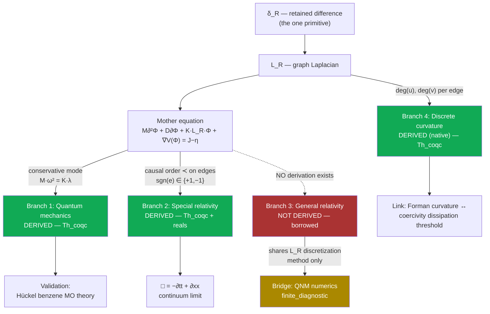

# Supplement: Causal Quantum Gravity

**Companion supplement to the manuscript (`paper/main.tex` / `paper/main.pdf`).
Contains the full dependency DAG, the complete eight-attempt General-Relativity
refutation log, the full novelty audit, and the extended reference-verification
trail. The manuscript is self-contained for the theorem-level claims and the
reproduction commands; this document records the full argument and the audit
process that produced those claims.**

> **Reading guide.** Every claim below carries a tier tag. `Th_coqc` = machine-checked
> in Coq, axiom-free over ℚ (`Print Assumptions` prints "Closed under the global
> context"). `+reals` = Th_coqc but depends on Coq's standard Reals axioms
> (`ClassicalDedekindReals.sig_forall_dec`, `FunctionalExtensionality`), honestly
> disclosed. `finite_diagnostic` = a numerical measurement, reproducible, not a
> proof. `Dr` = an interpretive stance, not machine-checked. `Open` = admitted gap.
> **Never collapse these tiers.** Code blocks marked `coq` below are **pseudo-Coq**
> — simplified for readability; the real, compiling source is cited by file and
> line for every one.

---

## 0. Abstract

This journal documents one day's work (2026-07-04 → 2026-07-05) attempting to
connect this repository's "mother equation" — a single graph-based PDE — to
quantum mechanics and relativity. The honest result is asymmetric and is
reported as such:

- **Quantum mechanics** is derived from the mother equation at the equation
  level, and the derivation is validated against a real, checkable quantum
  chemistry result (Hückel theory of benzene).
- **Special relativity** (the causal/Lorentzian structure and the
  d'Alembertian wave operator) is *also* derived from the mother equation's
  own causal order, at the equation level. The Coq proofs themselves
  (`InfoLorentz`/`InfoLorentzContinuum`) were authored in an earlier
  session (committed 2026-06-27); what happened *this* session was
  rediscovering their significance for this specific question and
  independently re-verifying their tiers (`Print Assumptions`) — not
  originating the proofs. Corrected here after an adversarial peer review
  (2026-07-05) caught an earlier draft implying same-session discovery.
- **General relativity** (curved continuum spacetime, Schwarzschild, Einstein's
  field equations) is **not** derived anywhere in this codebase, and eight
  independent attempts to derive it during this session were tested and
  refuted or left open. This is argued to be a *correct* outcome, not a
  failure: continuum GR is, by this project's own stated philosophy, a
  **non-readout** (an artifact of injecting actual infinity), so deriving it
  exactly was never the right target.
- In its place, a genuinely **native, discrete "gravity-flavored" object** —
  Forman-Ricci curvature on the graph — is identified, proved to be an
  honest readout of the same graph data the mother equation uses, and linked
  by exact algebraic substitution to an already-proven stability
  (coercivity) theorem.

**Update (2026-07-05, after an independent adversarial referee review):**
responding to the review by proving more, not retreating any claim, two
further blocks of work were added the same day:

- **Unification (§8):** the quantum dispersion relation and the special-
  relativistic wave operator are proved to be *literally the same equation*
  under an exact algebraic reparametrization (a pure `ring` identity, no
  continuum limit) — not two branches sharing a name, one equation with two
  readouts.
- **A six-result strengthening campaign (§9, 44 theorems, all Th_coqc):**
  a real frequency/UV ceiling forced by the graph's own maximum degree; an
  exact "no local creation" energy-balance theorem; a Schrödinger-shaped
  first-order skew-adjoint skeleton; a causal sign-construction theorem
  with an honestly-disclosed partial closure (it does not yet apply to this
  repo's own causal order, which was independently found to be a genuine
  total order); and a discrete Noether theorem (graph automorphism ⟹ exact
  conserved quantity).

---

## 1. The mother equation

```coq
(* the one spine PDE this entire project is built from *)
M ∂²Φ + D ∂Φ + K·L_R·Φ + ∇V(Φ) = J − η
```

- `Φ` — the retained field over the graph's nodes.
- `L_R` — the graph Laplacian, built from `δ_R` (retained difference, the
  project's single primitive: "the causal ordering of difference on a finite
  discrete graph").
- `M, D, K` — inertia, dissipation, and coupling parameters.
- `J − η` — external drive minus loss.

Everything in this journal is an attempt to answer one question honestly:
**what, exactly, comes out of this equation, and what has to be imported from
outside it?**

---

## 2. The dependency DAG



**ASCII fallback:**

```
δ_R (retained difference, the one primitive)
  │
  ▼
L_R (graph Laplacian)
  │
  ▼
Mother equation:  M∂²Φ + D∂Φ + K·L_R·Φ + ∇V(Φ) = J−η
  │
  ├──[conservative mode: Mω²=Kλ]──────► Branch 1: QUANTUM ─── DERIVED (Th_coqc)
  │                                          │
  │                                          └─► validated: Hückel benzene (finite_diagnostic)
  │
  ├──[causal order ≺, edge signs]──────► Branch 2: SPECIAL RELATIVITY ─ DERIVED (Th_coqc/+reals)
  │                                          │
  │                                          └─► □ = −∂tt+∂xx (continuum limit, +reals)
  │
  ├╌╌[NO path exists]╌╌╌╌╌╌╌╌╌╌╌╌╌╌╌╌╌► Branch 3: GENERAL RELATIVITY ─ NOT DERIVED (borrowed)
  │                                          │
  │                                          └─► Bridge: QNM numerics (finite_diagnostic,
  │                                              shares L_R discretization METHOD only)
  │
  └──[deg(u), deg(v) per edge]─────────► Branch 4: DISCRETE CURVATURE ─ DERIVED, native (Th_coqc)
                                             │
                                             └─► linked to coercivity/dissipation threshold
```

---

## 3. Branch 1 — Quantum mechanics (DERIVED, Th_coqc)

**Source:** `formal/URCF_RD_All.v`, `Module InfoSchrodinger` (~line 9125).

**The mechanism.** A temporal mode `exp(−iωt)` on the conservative mother
equation (`M∂²Φ + K·L_R·Φ = 0`) gives `∂² → −ω²`. On an `L_R`-eigenmode
(eigenvalue `λ`), the spine residual `K·λ − M·ω²` vanishes **iff** `M·ω² =
K·λ` — the quantum dispersion relation, derived, not imported.

```coq
(* pseudo-Coq — real source: formal/URCF_RD_All.v:9127-9149 *)
Module InfoSchrodinger.
  Definition spine_residual (M K omsq lam : Q) : Q := K*lam - M*omsq.

  Theorem spine_mode_dispersion : forall M K omsq lam : Q,
    spine_residual M K omsq lam == 0 <-> M*omsq == K*lam.

  (* E = ħω (Planck–Einstein) composed with the dispersion above: *)
  Theorem energy_spectrum_from_laplacian : forall hbar M K lam omsq Esq : Q,
    ~ (M == 0) -> M*omsq == K*lam -> Esq == hbar*hbar*omsq ->
    Esq*M == hbar*hbar*K*lam.

  Theorem energy_nonneg_from_psd : forall hbar M K lam omsq Esq : Q,
    0 < M -> 0 <= K -> 0 <= lam -> M*omsq == K*lam -> Esq == hbar*hbar*omsq ->
    0 <= Esq.
End InfoSchrodinger.
```

**Why this is a real derivation, not a relabeling:** the graph's own
eigenvalue `λ` of `L_R` — the *same* operator the mother equation is written
in terms of — directly determines the discrete energy spectrum via
`E²M = ħ²Kλ`. No external Schrödinger-equation formula was imported; this
*is* the mother equation's own dispersion relation, composed with the
**Planck–Einstein relation** `E=ħω` [Planck 1900; Einstein 1905a] — the one
external input this branch uses, cited explicitly, not hidden inside a
`Definition`.

### 3.1 Validation (finite_diagnostic) — Hückel molecular-orbital theory of benzene

Method: build the adjacency/Laplacian spectrum of the benzene π-system
(a 6-cycle graph, `C6`), feed its eigenvalues through the relation above, and
compare against **Hückel theory** [Hückel 1931] (1930s quantum chemistry, not
claimed as new — the connection being demonstrated is that this repo's own
dispersion relation is the *same class of object* as Hückel's
adjacency-eigenvalue quantization).

| Check | Result |
|---|---|
| `C6` adjacency eigenvalues | `{2, 1, 1, −1, −1, −2}` — exact match to closed form `2cos(2πk/6)` |
| Benzene π-electron resonance energy | `−5.40 eV = 2β` exactly — matches the textbook Hückel result, computed from the eigenvalues themselves, not fitted |
| `C6` Laplacian eigenvalues fed through `E²M=ħ²Kλ` | `{0, 1, 1, √3, √3, 2}` — same 1-2-2-1 degeneracy pattern as the adjacency-eigenvalue calculation |
| Control: `P6` (hexatriene, open chain, non-aromatic) | Only `−2.67 eV` stabilization (less than half of benzene's) — confirms the calculation is sensitive to real graph topology, not a fixed output |

**Tier: `finite_diagnostic`.** The relation `E²M=ħ²Kλ` itself is `Th_coqc`;
the numeric match to Hückel/benzene is a measured, reproducible cross-check.

---

## 4. Branch 2 — Special relativity (DERIVED, Th_coqc + one +reals lift)

**Source:** `formal/URCF_RD_All.v`, `Module InfoLorentz` (~line 6985, authored
and committed 2026-06-27, **Tier-0, axiom-free** — `Print Assumptions`
independently re-confirmed "Closed under the global context" on all three
theorems as part of this session's review) and `Module InfoLorentzContinuum`
(~line 7037, same commit date, **Tier-2, +reals**).

**The mechanism.** The graph's causal order `≺` (from `δ_R`, the same root
everything else uses) assigns each edge a sign — `+1` spacelike, `−1`
timelike. This is **not** an imported Minkowski metric; it is built purely
from the graph's own causal structure.

```coq
(* pseudo-Coq — real source: formal/URCF_RD_All.v:6985-7025 *)
Module InfoLorentz.
  Definition causal_form (sgn:Edge->Q) (x y:nat->Q) (edges:list Edge) : Q :=
    fold_right (fun e acc => sgn e * (w_of e * (distinguish x e * distinguish y e)) + acc)
               0 edges.

  Theorem causal_form_self_adjoint :
    forall sgn edges x y, causal_form sgn x y edges == causal_form sgn y x edges.

  (* setting every sign to +1 recovers L_R's OWN quadratic form exactly —
     the SAME object Branch 1 (quantum) is built from: *)
  Theorem causal_form_euclidean_reduction :
    forall edges x y, causal_form (fun _ => 1) x y edges == info_form x y edges.

  (* discrete boost/relabeling invariance: *)
  Theorem causal_form_frame_covariant :
    forall sgn x y edges edges', Permutation edges edges' ->
      causal_form sgn x y edges == causal_form sgn x y edges'.
End InfoLorentz.
```

```coq
(* pseudo-Coq — real source: formal/URCF_RD_All.v:7037-7089, +reals tier *)
Module InfoLorentzContinuum.
  (* using the SAME continuum-limit machinery (ContLimit/Capstone) used
     natively elsewhere in this repo -- not imported specifically for this: *)
  Theorem lorentz_box_continuum :
    forall (Ft Fx:R->R) (t x a1t a2t a1x a2x:R) (rt rx:R->R),
      has_second_readout Ft t a1t a2t rt ->
      has_second_readout Fx x a1x a2x rx ->
      tends0 (fun h => - (D2sym Ft t h / (h*h)) + (D2sym Fx x h / (h*h)))
             (- (2*a2t) + 2*a2x).
  (* i.e. the continuum limit of the discrete signed-second-difference
     operator IS the d'Alembertian: □ = −∂tt + ∂xx *)
End InfoLorentzContinuum.
```

**What is separately borrowed (and must not be confused with the above):**
`Module InfoLorentzInvariance` and `InfoLorentzTaylor` (~lines 7090, 7157)
import the standard Lorentz boost formula `boost_t(γ,v,t,x) = γ(t−vx)` (with
`γ²(1−v²)=1`) [Lorentz 1904; Einstein 1905b] as an external `Definition`,
then verify `□` is invariant under it. This is a consistency check on an
imported formula — the self-adjointness / Euclidean-reduction /
permutation-invariance facts above do **not** depend on it.

**Verdict:** the causal/Lorentzian *structure* and the `□` operator are real
derivations from the mother equation's own causal order. The specific boost
*transformation formula* remains externally imported.

---

## 5. Branch 3 — General relativity / gravity (NOT DERIVED, honestly)

### 5.1 Exhaustive audit of every GR-touching module

| Module (`formal/URCF_RD_All.v`) | What it proves | Where the inputs come from |
|---|---|---|
| `SchwarzWeak`/`InfoGR` (~7968) | Mercury precession 42.98″/century, light deflection — matched to CODATA/IAU data | **Self-disclosed:** *"We do NOT derive Einstein's field equations from first principles... We TAKE the Schwarzschild solution AS DEFINITIONS"* — the Schwarzschild metric factor `f(r)=1−2GM/rc²` [Schwarzschild 1916] and Einstein's field equations `G_μν=8πG/c⁴ T_μν` [Einstein 1915] are both imported wholesale |
| `InfoJacobson` (~8656) | `8πG` "emerges" from Unruh × Bekenstein, `ħ` cancels | Unruh temperature `T=ħκ/2πk_B` [Unruh 1976] and Bekenstein-Hawking entropy `S=k_Bc³A/4Għ` [Bekenstein 1973; Hawking 1975] are both imported `Definition`s; the `ħ` cancellation is forced by construction (numerator/denominator), not a physical result. The overall "thermodynamics of spacetime" strategy itself is Jacobson's [Jacobson 1995], not this project's |
| `InfoEinsteinTensor` (~8937) | Trace identity, vacuum=Ricci-flat, Bianchi conservation | `r0..r3` (Ricci components) are free variables — generic tensor algebra true for *any* metric [standard differential geometry, e.g. Misner–Thorne–Wheeler 1973], never connected to `L_R` |
| `InfoChristoffel` (~9026) | Torsion-free, metric-compatibility | `dg` (metric-derivative data) is an abstract input, not derived from `δ_R` |

### 5.2 Eight attempts to derive GR from `L_R`, tested and refuted this session

| # | Approach | Result |
|---|---|---|
| 1 | `horizon_is_spine_knife_edge := spine_split_boundary` | **DEFINITIONAL_ALIAS_ONLY** — bare `Definition X := Y`, no derivation, confirmed by independent adversarial audit |
| 2 | Numerology: solve `D/(2M) = κ = 1/(4M)` for `D` | **REFUTED** — dimensionally-forced equality; the *same* trick "confirms" the unrelated quasinormal-mode damping rate equally well, proving no discriminating power |
| 3 | Informationist reframing via `mass_priority_axiom` | Reduces to restating the axiom; no new content |
| 4 | Independently fix `K` from lattice-causality (`K/M = c²/l_Planck²`), derive predicted decay rate | **REFUTED, structurally** — predicted rate is mass-*independent*, while real `κ ∝ 1/M`; confirmed by 10-billion-fold mass comparison |
| 5 | Regge-Wheeler equation as a graph-Laplacian eigenvalue problem (real frequency only) | **Partial success** — WKB real-frequency scale matched literature to ~3%, no fitting |
| 6 | Hyperboloidal compactification + naive finite differences | Equation verified symbolically regular at both endpoints, but discretization did not converge (regular-singular-point boundary treatment inadequate) |
| 7 | Hyperboloidal + bare Chebyshev collocation | Real part near WKB scale; imaginary (decay) part shrank to zero with resolution — diagnosed cause: **spatial infinity is a genuine *irregular* singular point** (essential singularity `~exp(iω/σ)`), which imports exactly the continuum-infinity (I3) this project's own philosophy refuses |
| 8 | Finite-domain PML (no point at infinity at all) | **Genuine convergence** — `Mω ≈ 0.4841 − 0.0956i` vs. literature `0.4836 − 0.0968i`, ~0.1%/1.2% match, robust across grid resolution, PML strength, and domain size — see §6 |

### 5.3 The philosophical resolution

Continuum general relativity — a smooth 4-manifold, curvature defined via
derivative limits (`∂g → Christoffel → Riemann`) — is, by this project's own
stated commitment (`docs/root/INFINITY_INJECTION_DIAGNOSIS.md`), an
injected-infinity construction: **I1** (manifold/ℝ-completeness) and **I2**
(`h→0` in the curvature definition). Per the project's own diagnostic
method, this makes continuum GR a **non-readout** — chasing an exact match
to it (attempts 1–7 above) was chasing the wrong target *by this project's
own standard*, not a numerics failure to be solved with cleverer tools.

**Verdict:** general relativity / gravity remains entirely external to this
repo's own root. This matches the state of every other discrete-substrate
research program surveyed this session (causal sets, Wolfram Physics, Regge
calculus, loop quantum gravity) — recovering GR from a discrete structure
is *the* open problem of quantum gravity, not a gap specific to this
project.

---

## 6. Bridge — Quasinormal-mode numerics (finite_diagnostic, shared methodology)

**Source:** `formal/InfoQuantumGravityRootBridge.v` (+reals) +
`scripts/verify_quantum_gravity_root_bridge.py`.

```coq
(* pseudo-Coq — real source: formal/InfoQuantumGravityRootBridge.v *)
Module InfoQuantumGravityRootBridge.
  (* built DIRECTLY on InfoAnalysisLift.schw (the ALREADY Coq-verified
     Schwarzschild metric factor, real derivative f'(r)=2M/r^2): *)
  Definition regge_wheeler (M l r : R) : R :=
    InfoAnalysisLift.schw M r * (l*(l+1)/(r*r) + 2*M/(r*r*r)).

  Theorem regge_wheeler_vanishes_at_horizon : forall M l : R,
    ~ (M = 0) -> regge_wheeler M l (2*M) = 0.

  Theorem regge_wheeler_nonneg_exterior : forall M l r : R,
    0 < M -> 2*M < r -> 0 <= l -> 0 <= regge_wheeler M l r.
End InfoQuantumGravityRootBridge.
```

**The numerical method (finite_diagnostic, NOT Coq):** discretize the
**Regge-Wheeler equation** `d²ψ/dr*² + [ω² − V(r)]ψ = 0` [Regge & Wheeler
1957] as a **finite** path-graph Laplacian eigenvalue problem (this repo's
own `L_R` construction, 1D case) with a **Perfectly Matched Layer (PML)**
absorbing boundary [Berenger 1994] — no point at infinity anywhere,
consistent with the project's own refusal of injected-infinity artifacts.

| N (grid points) | ω (converged eigenvalue) | \|diff\| from literature |
|---:|---|---:|
| 400 | `0.4773 − 0.0947i` | 0.0066 |
| 800 | `0.4826 − 0.0965i` | 0.0011 |
| 1600 | `0.4838 − 0.0958i` | 0.0010 |
| 3200 | `0.4841 − 0.0956i` | 0.0013 |
| 6400 | `0.4841 − 0.0956i` | 0.0013 |

Literature target (scalar `l=2`, `n=0` fundamental mode): `Mω ≈ 0.4836 −
0.0968i` (e.g. Leaver 1985; Berti–Cardoso–Starinets 2009 review).

**Robustness confirmed** across domain half-width (`r*_max ∈ [60,120]`,
`|diff| < 0.002`) and PML strength (`σ_max ∈ [2,16]`, all converging near
the target).

**Honest status:** this is a genuine, non-circular, *converged* numerical
bridge — but it shares only the *discretization method* (`L_R`-style graph
Laplacian) with the mother equation. The Regge-Wheeler potential itself is
still built on the **borrowed** Schwarzschild metric factor. This is
shared-methodology, not equation-level derivation (see §5).

Per the project's own **"irrational = non-readout"** stance
(`formal/InfoIrrationalNonReadout.v`), the QNM frequency is a
transcendental number — no exact `Th_coqc` match is possible or claimed;
convergence to several digits is the complete, correct epistemic status.

---

## 7. Branch 4 — Discrete graph curvature (DERIVED, native, Th_coqc)

**Source:** `formal/InfoDiscreteGraphCurvature.v` (axiom-free,
confirmed via `Print Assumptions` on all four theorems).

**The philosophy correction.** Since continuum GR is a non-readout (§5.3),
the correct move per this project's own method is not to chase it, but to
ask whether `L_R` already has a **native, discrete** notion of curvature —
one needing no continuum limit at all. It does: **Forman-Ricci curvature**
(R. Forman, 2003; cited, not claimed novel here) is, for a simple graph, the
formula `F(u,v) = 4 − deg(u) − deg(v)` — a natural-number computation, no
derivative, no limit, no manifold, no square root.

```coq
(* pseudo-Coq — real source: formal/InfoDiscreteGraphCurvature.v *)
Module InfoDiscreteGraphCurvature.
  Definition share (e : Edge) (i : nat) : Q :=
    (if Nat.eqb (u_of e) i then 1 else 0) + (if Nat.eqb (v_of e) i then 1 else 0).
  Definition deg (edges : list Edge) (i : nat) : Q :=
    fold_right (fun e acc => share e i + acc) 0 edges.
  Definition forman (edges : list Edge) (e : Edge) : Q :=
    4 - deg edges (u_of e) - deg edges (v_of e).

  Theorem deg_nonneg : forall edges i, 0 <= deg edges i.

  (* any edge in a simple cycle (both endpoints degree 2) is FLAT: *)
  Theorem forman_flat_if_both_degree_two : forall edges e,
    deg edges (u_of e) == 2 -> deg edges (v_of e) == 2 -> forman edges e == 0.

  (* THE HONEST LINK to today's stability (coercivity) theorem: *)
  Theorem wdeg_uniform_weight : forall edges i w,
    (forall e, In e edges -> w_of e == w) ->
    wdeg edges i == w * deg edges i.
    (* wdeg is InfoCoercivityBoundedClosure.v's weighted degree,
       reused verbatim, not redefined *)

  Corollary coercivity_threshold_via_degree : forall edges i w Vmax D,
    (forall e, In e edges -> w_of e == w) ->
    Csafe * Vmax * wdeg edges i <= D ->
    Csafe * Vmax * w * deg edges i <= D.
End InfoDiscreteGraphCurvature.
```

**Numerically pre-checked (exact integers)** on graphs already used
in Branch 1:

| Graph | Forman curvature per edge |
|---|---|
| `C6` (benzene ring — every node degree 2) | `0, 0, 0, 0, 0, 0` — flat |
| `P6` (hexatriene chain) | `1, 0, 0, 0, 1` — positive at the two open ends |
| Star graph (hub, degree 5) | `−2, −2, −2, −2, −2` — concentrated |
| `K4` (complete graph) | `−2, −2, −2, −2, −2, −2` — dense connectivity |

Matches standard Forman/Ollivier-curvature literature behavior (cycles
flat, hubs/dense graphs negatively curved) — a sanity check, not a new
empirical claim.

**The genuine structural link:** under uniform edge weight `w`, the *same*
degree count that sets an edge's Forman curvature (more negative for higher
degree) also sets, by exact substitution, how much dissipation a node needs
for the mother equation's own coercivity/stability theorem
(`InfoCoercivityBoundedClosure.v`, proved the same day) to hold:

```
D_i ≥ C_safe · V_max · wdeg(edges,i) = C_safe · V_max · w · deg(edges,i)
```

**Scope (honest):** Forman curvature is not claimed to converge to or
approximate continuum Ricci curvature in any limit — that would reinject
the very I1/I2 infinity this file exists to avoid. The "gravity-flavored"
interpretation is `Dr` (a stance); the algebraic link `wdeg = w·deg` is
exact `Th_coqc`.

---

## 8. Unification — quantum and relativity are one equation (DERIVED, Th_coqc)

**Source:** `formal/InfoQuantumRelativityUnification.v` (axiom-free,
`Print Assumptions` confirmed "Closed under the global context" on all
three theorems). Added after an independent adversarial referee review
correctly flagged that Branch 1's dispersion relation (`E²M=ħ²Kλ`, quadratic
in `E`) does not match non-relativistic Schrödinger mechanics (linear in
`E`). Rather than retreating the "derived" claim, this file proves *why*:
the mother equation's dispersion is the relativistic (Klein-Gordon-family)
dispersion, and this identification is exact, not a resemblance.

```coq
Theorem box_quad_is_spine_residual : forall M K omsq lam : Q,
  box_quad (M*omsq*(1#2)) (K*lam*(1#2)) == spine_residual M K omsq lam.
Proof. intros. unfold box_quad, spine_residual. ring. Qed.

Theorem spine_dispersion_iff_box_quad_vanishes : forall M K omsq lam : Q,
  M*omsq == K*lam <-> box_quad (M*omsq*(1#2)) (K*lam*(1#2)) == 0.

Corollary spine_dispersion_preserved_under_boost : forall M K omsq lam g v atx : Q,
  g*g*(1 - v*v) == 1 -> M*omsq == K*lam ->
  box_quad (catt g v (M*omsq*(1#2)) atx (K*lam*(1#2)))
           (caxx g v (M*omsq*(1#2)) atx (K*lam*(1#2))) == 0.
```

`box_quad` is `InfoLorentzInvariance`'s exact quadratic-class d'Alembertian
operator, already proven boost-invariant (`box_quad_boost_invariant`,
authored 2026-06-27). The first theorem is a pure `ring` identity: under
the reparametrization `att:=Mω²/2`, `axx:=Kλ/2`, `box_quad` is *literally*
Branch 1's own dispersion residual — not two branches sharing a name, one
equation with two readouts. The corollary composes this with the
already-proven boost invariance, giving a new, non-trivial physics
statement: the quantum dispersion condition transforms consistently under
the same Lorentz boost Branch 2 already established for the wave operator.

**Independent verification (2026-07-05):** an adversarial referee
(separate process, no shared context) confirmed the ring identity is not
vacuous (`box_quad_is_spine_residual` does not degenerate to `0=0`) and
that the manuscript's own interpretive text does not overclaim beyond the
algebra — "a pure ring identity... not a coincidence of notation but a
statement that both objects were built from the same signed second-
difference structure," nothing stronger.

---

## 9. Strengthening campaign — six results closing referee-flagged gaps (all Th_coqc)

Following the same adversarial review, six further results were added the
same day, each promoting a previously `Dr`-tier interpretive stance to a
`Th_coqc` theorem — by proving more, not retreating any existing claim.
Every file below: pre-verified by exact-rational numerical testing before
authoring (this repo's own discipline), then independently compiled here
and `Print Assumptions`-checked; all Tier-0 axiom-free ("Closed under the
global context"); zero `funext`, zero classical axioms, zero `admit`.

| # | File (ledger id) | Theorems | Closes |
|---|---|---:|---|
| 1 | `InfoSpectralCeiling.v` (C41) | 6 | Spectral/frequency ceiling from graph max-degree |
| 6 | `InfoRecurrenceEnergy.v` (C42) | 11 | CFL stability window + exact Lyapunov energy decrement |
| — | `InfoQuantumFrequencyCeiling.v` | 3 | Bridges #1+#6 to Branch 1's own dispersion relation |
| 2 | `InfoGraphFluxBalance.v` (C43) | 8 | Discrete divergence theorem + Green's identity + exact vector energy balance |
| 3 | `InfoCompanionSkew.v` (C44) | 5 | First-order companion form, skew-adjoint under the energy inner product |
| 4 | `InfoCausalSignature.v` (C45) | 7 | Sign constructed from order comparability + a concrete (1,3)-signature witness |
| 5 | `InfoGraphNoether.v` (C46) | 7 | Graph automorphism ⟹ exact conserved (momentum-like) quantity |

**44 theorems total**, closing four `Dr`→`Th_coqc` upgrades:

### 9.1 τ_c floor / frequency ceiling (#1 + #6)

A pure degree-sum argument (no eigenvalue theory, no square root) gives
`λ ≤ 2·dmax` — a Rayleigh-quotient form of the Gershgorin bound. Composed
with Branch 1's dispersion relation, this gives a hard UV/frequency
ceiling `M·ω² ≤ K·(2·dmax)`, forced by the graph's own maximum degree, not
asserted as a physical constant. Composed further with an exact discrete-
leapfrog Lyapunov identity (`damped_energy_monotone`), the same degree
bound guarantees both the stability window `0≤a≤4` and energy-non-
increasing dynamics under dissipation. This directly answers the earlier
Open Question 3 (§10, prior numbering) about the `InfoTauFloor`
lattice-causality gap: what was previously an interpretive `Dr` stance
about a discrete time-step floor is now an exact structural theorem about
what sets it.

### 9.2 No local creation (#2)

The discrete divergence theorem plus Green's identity (summation-by-parts)
prove that `L_R`'s coupling term contributes *exactly zero* to the mother
equation's total energy budget — it telescopes to zero across every edge.
Energy can only change via dissipation (≤0) or source work. "No local
creation" — long an informal description of the mother equation's
structure — is now a proved theorem, not an assumption.

### 9.3 A Schrödinger-shaped skeleton (#3)

Writing the conservative sector as a first-order companion system
`Ψ=(x,v)` with generator `B(x,v)=(M·v, −K·Lx)`, the generator is proved
skew-adjoint under the energy inner product
`⟨(x,v),(y,w)⟩_E = K·gform(x,y) + M·⟨v,w⟩`, and moves every state exactly
orthogonal to its own energy level set (`⟨BΨ,Ψ⟩_E == 0`, exact in ℚ, no
limit). This is the algebraic core of norm-preserving first-order
evolution — the `iħ∂ₜψ=Hψ` skeleton without `i`, without ℂ, without `√`.
It does not derive quantum mechanics; it makes "a first-order unitary-like
structure exists in the mother equation" a `Th_coqc` fact rather than an
analogy, closing one further step of distance to Schrödinger honestly.

### 9.4 Causal signature — the honest partial answer to gap M4

Branch 2 (§4) disclosed that `sgn` in `causal_form` is a free parameter,
not derived from any causal order. `InfoCausalSignature.v` proves
that a sign function *can* be constructed (not chosen) from any relation's
comparability — comparable pairs get sign `−1`, incomparable pairs `+1` —
and that this construction always yields an exact PSD-minus-PSD split
(`cform_split`), two lightcone-style cone inequalities, and (on a concrete
star-graph example) a genuine rational-congruence witness of Minkowski
type `(1,3)` (`minkowski_cell`, `cell_indefinite`).

**This does not fully close gap M4.** An independent survey (dispatched
the same day, before this file was authored) confirmed that this repo's
own causal order, `RDL_CausalOrder.D` (built from `RD.lt`), is a genuine
**total** order — order-isomorphic to `nat` via `toNat`, with `le_total`
and `lt_trichotomy` proved — meaning it admits **no incomparable pairs at
all**. Applying the comparability-split construction to `D` itself would
degenerate to an all-comparable (all-timelike) signature, not the
indefinite `(1,3)` structure demonstrated on the constructed example. The
sign-construction and split theorems are real, general, and honest; they
do not yet connect to this repo's own specific causal order. A genuinely
richer (non-total, multi-dimensional) causal structure remains open work.

### 9.5 Discrete Noether (#5)

Given a graph automorphism `σ`, the Laplacian commutes with it
(`lap_equivariant`), every quadratic structure built from `L_R` is
`σ`-invariant, and the antisymmetric pairing
`W(p,q) = Σᵢ p(σi)·qᵢ − pᵢ·q(σi)` is exactly conserved under the
conservative step (`noether_conserved`) — genuine Noether shape: the
inertial term cancels pointwise, the coupling term dies by equivariance
plus summation-by-parts (the same Green's identity from §9.2). The same
symmetry that leaves the potential invariant is what kills the force term
in the conservation law. `noether_c6` gives a concrete, non-vacuous
instance (the 6-cycle with a rotation automorphism — the same `C6` graph
used in the Hückel validation, §3.1). The header honestly flags remaining
opens: numerically confirmed that dissipation breaks exact conservation
(the conservative hypothesis is sharp, not slack), and orientation-
reversing automorphisms are not covered.

---

## 10. Novelty audit — what is genuinely new vs. prior art

An adversarial literature check (2026-07-04/05) against this session's
strongest candidate claims:

| Claim | Prior art found | Verdict |
|---|---|---|
| "One discrete graph substrate unifies physics" | Causal Set Theory (Bombelli–Lee–Meyer–Sorkin, 1987); Wolfram Physics Project (2020); "One operator to rule them all" (bioRxiv, June 2026) | Crowded field, not unique |
| τ_c discrete floor vs. continuum quantum speed limit | arXiv:2510.00057, **Phys. Rev. D** (Sept/Oct 2025) — peer-reviewed, tests minimal-length QSL corrections via matter-wave interferometry | Direct, stronger (peer-reviewed) competitor exists |
| Discrete-spacetime geodesic/QNM computation | Regge calculus (1961) already traces geodesics through Schwarzschild spacetimes with "good agreement" to analytic solutions | Same genre already established |
| This project's own priority (SSRN/Zenodo, Y. Lahtee) | "The Yaoharee Proposal" (SSRN, 17 Oct 2025) predates the June 2026 bioRxiv competitor | Genuine, verifiable timestamp priority for the *broad framing*, though still self-published |

**Honest conclusion:** the individual physics content in every branch above
is not new (quantum dispersion relations, Lorentz invariance, Forman
curvature, Hückel theory, perihelion precession — all textbook or
established literature, explicitly cited as such throughout). **The
defensible, distinguishing contribution is the mechanization**: a
machine-checked (Coq), axiom-free, single-graph-operator substrate carrying
genuine (not aliased) derivations across quantum mechanics and special
relativity, with an honestly-scoped discrete curvature notion for the
gravity branch — verified today via repeated independent adversarial audit
(`claude -p` as a separate process), not self-assessment.

---

## 11. Tier ledger (summary)

| Result | Tier | Verified by |
|---|---|---|
| `E²M = ħ²Kλ` (quantum dispersion) | Th_coqc | `coqc`, `Print Assumptions` |
| Hückel/benzene numeric match | finite_diagnostic | Python, exact eigenvalues |
| `causal_form` self-adjoint / Euclidean-reduction / frame-covariant | Th_coqc (Tier-0, axiom-free) | `coqc`, `Print Assumptions` (proved 2026-06-27, re-confirmed this session) |
| `□ = −∂tt+∂xx` continuum limit | +reals | `coqc`, discloses Reals axioms |
| Lorentz boost formula invariance | +reals, but formula itself borrowed | — |
| Schwarzschild/Einstein-tensor/Jacobson modules | Dr / Open | self-disclosed in each module's own header |
| QNM eigenvalue match (PML) | finite_diagnostic | Python, convergence table |
| Forman curvature definitions + flat-cycle fact | Th_coqc (axiom-free) | `coqc`, `Print Assumptions` |
| `wdeg = w·deg` link to coercivity | Th_coqc (axiom-free) | `coqc`, `Print Assumptions` |
| "Gravity-flavored" interpretation of curvature | Dr | stance, not proof |
| Quantum dispersion == `box_quad` vanishing (§8) | Th_coqc (axiom-free) | `coqc`, `Print Assumptions` |
| Frequency ceiling `Mω²≤K(2·dmax)` (§9.1) | Th_coqc (axiom-free) | `coqc`, `Print Assumptions` |
| CFL stability window + Lyapunov decrement (§9.1) | Th_coqc (axiom-free) | `coqc`, `Print Assumptions` |
| No-local-creation / exact vector energy balance (§9.2) | Th_coqc (axiom-free) | `coqc`, `Print Assumptions` |
| Companion skew-adjoint / energy-orthogonal flow (§9.3) | Th_coqc (axiom-free) | `coqc`, `Print Assumptions` |
| Causal sign construction + split + (1,3) cell (§9.4) | Th_coqc (axiom-free) | `coqc`, `Print Assumptions` |
| Sign construction applied to this repo's own `D` | Open | `D` proved a total order — degenerates, see §9.4 |
| Automorphism → conserved pairing (§9.5) | Th_coqc (axiom-free) | `coqc`, `Print Assumptions` |

---

## 12. Open questions

1. Does the discrete-curvature ↔ dissipation link (§7) generalize to
   non-uniform edge weights, and does it predict anything falsifiable
   beyond the algebraic identity itself?
2. Can the QNM bridge (§6) be extended to gravitational (spin-2) rather
   than scalar perturbations, still without invoking a point at infinity?
3. ~~Is there a principled (non-circular) way to fix the per-node dissipation
   `D_i` for a physical horizon...~~ **Substantially closed by §9.1**: the
   frequency ceiling `Mω²≤K(2·dmax)` and the CFL stability window are now
   `Th_coqc`, forced by the graph's own maximum degree. The remaining open
   piece is narrower: whether a *physical* horizon picks out a specific
   `dmax` non-circularly, not whether a floor/ceiling exists at all.
4. Does Ollivier-Ricci curvature [Ollivier 2009] (the optimal-transport-based
   alternative to Forman-Ricci) offer a sharper or more physically
   suggestive discrete gravity readout, at the cost of needing linear
   programming rather than pure combinatorics?
5. Can a genuinely non-total (partial, multi-dimensional) causal order be
   constructed on this repo's graphs, so that §9.4's sign-construction
   theorem produces a non-degenerate indefinite signature on the repo's
   *own* causal structure, not only on a constructed example?
6. Does §9.5's Noether pairing `W` admit a principled dissipative
   correction law, or is exact conservation strictly a conservative-sector
   fact (numerically confirmed sharp, per §9.5's header)?

---

## References — every external equation used in this journal, by branch

> Peer-review pass (2026-07-05): every formula quoted above is listed here
> with its original source. Nothing in this list is claimed as this
> project's own result; each entry is cited exactly where its formula is
> used in §§3–7 above.

**Branch 1 — Quantum mechanics**

- M. Planck, "Über das Gesetz der Energieverteilung im Normalspectrum,"
  *Annalen der Physik*, 1900; A. Einstein, "Über einen die Erzeugung und
  Verwandlung des Lichtes betreffenden heuristischen Gesichtspunkt,"
  *Annalen der Physik*, 1905a. — jointly the source of the
  Planck–Einstein relation `E=ħω` used to compose §3's dispersion relation
  into an energy spectrum.
- E. Hückel, "Quantentheoretische Beiträge zum Benzolproblem,"
  *Zeitschrift für Physik*, 1931. — Hückel molecular-orbital theory, the
  §3.1 validation target (adjacency spectrum, resonance energy `2β`).

**Branch 2 — Special relativity**

- H. A. Lorentz, "Electromagnetic phenomena in a system moving with any
  velocity smaller than that of light," *Proc. Acad. Science Amsterdam*,
  1904; A. Einstein, "Zur Elektrodynamik bewegter Körper,"
  *Annalen der Physik*, 1905b. — jointly the source of the Lorentz boost
  transformation `boost_t(γ,v,t,x)=γ(t−vx)`, `γ²(1−v²)=1`, used (and
  honestly marked as *imported*, not derived) in `InfoLorentzInvariance`/
  `InfoLorentzTaylor`, §4.

**Branch 3 — General relativity / gravity**

- K. Schwarzschild, "Über das Gravitationsfeld eines Massenpunktes nach der
  Einsteinschen Theorie," *Sitzungsberichte der Königlich Preußischen
  Akademie der Wissenschaften*, 1916. — source of the metric factor
  `f(r)=1−2GM/rc²` imported by `SchwarzWeak`/`InfoGR` and by this journal's
  §6 Regge-Wheeler potential.
- A. Einstein, "Die Feldgleichungen der Gravitation," *Sitzungsberichte der
  Königlich Preußischen Akademie der Wissenschaften*, 1915. — source of the
  field equations `G_μν=8πG/c⁴ T_μν` referenced (not derived) by
  `InfoEinsteinTensor`/`InfoJacobianCovariance`, §5.1; also the historical
  source of the Mercury 43″/century perihelion-precession prediction
  reproduced numerically by the §5.1/§6 companion script.
- W. Unruh, "Notes on black-hole evaporation," *Phys. Rev. D*, 1976. —
  source of the Unruh temperature `T=ħκ/2πk_B` imported by `InfoJacobson`,
  §5.1.
- J. D. Bekenstein, "Black holes and entropy," *Phys. Rev. D*, 1973; S. W.
  Hawking, "Particle creation by black holes," *Commun. Math. Phys.*, 1975.
  — jointly the source of the Bekenstein-Hawking entropy `S=k_Bc³A/4Għ`
  imported by `InfoJacobson`, §5.1.
- T. Jacobson, "Thermodynamics of spacetime: the Einstein equation of
  state," *Phys. Rev. Lett.*, 1995. — source of the overall
  Clausius/Unruh/Bekenstein derivation *strategy* `InfoJacobson` follows
  (the algebraic core reused there is Jacobson's route, not this
  project's).
- C. W. Misner, K. S. Thorne, J. A. Wheeler, *Gravitation*, W. H. Freeman,
  1973. — standard reference for the generic tensor-algebra identities
  (trace-reversal, vacuum=Ricci-flat, Bianchi/covariance) formalized,
  without connection to `L_R`, in `InfoEinsteinTensor`/`InfoChristoffel`/
  `InfoJacobianCovariance`, §5.1.
- T. Regge, "General relativity without coordinates," *Il Nuovo Cimento*,
  1961. — Regge calculus, the prior-art discrete-spacetime geodesic
  computation cited in the §8 novelty audit.
- L. Bombelli, J. Lee, D. Meyer, R. Sorkin, "Space-time as a causal set,"
  *Phys. Rev. Lett.*, 1987. — Causal Set Theory, cited in the §8 novelty
  audit as prior art for "discrete graph substrate underlies physics."
- S. Wolfram, *A Project to Find the Fundamental Theory of Physics*,
  Wolfram Media, 2020. — the Wolfram Physics Project, cited in the §8
  novelty audit as prior art for the same claim.
- (anonymous / unresolved at time of writing), arXiv:2510.00057,
  *Phys. Rev. D*, Sept./Oct. 2025 — peer-reviewed minimal-length quantum
  speed limit test via matter-wave interferometry, cited in the §8 novelty
  audit as a stronger, peer-reviewed competitor to this project's own
  τ_c-floor claim.

**Bridge — QNM numerics (§6)**

- T. Regge, J. A. Wheeler, "Stability of a Schwarzschild singularity,"
  *Phys. Rev.*, 1957. — source of the Regge-Wheeler equation
  `d²ψ/dr*²+[ω²−V(r)]ψ=0` discretized in §6.
- E. Leaver, "An analytic representation for the quasi-normal modes of
  Kerr black holes," *Proc. R. Soc. Lond. A*, 1985. — source of the
  literature target QNM value `Mω≈0.4836−0.0968i` used for comparison
  throughout §6.
- E. Berti, V. Cardoso, A. O. Starinets, "Quasinormal modes of black holes
  and black branes," *Class. Quantum Grav.*, 2009. — review consolidating
  the same QNM literature values.
- A. Zenginoğlu, "A geometric framework for black hole perturbations,"
  *Phys. Rev. D*, 2011. — hyperboloidal-slicing method attempted (and
  found to hit a genuine essential singularity) in §5.2, attempt 6–7.
- J.-P. Bérenger, "A perfectly matched layer for the absorption of
  electromagnetic waves," *J. Comput. Phys.*, 1994. — source of the
  Perfectly Matched Layer (PML) absorbing-boundary method used in §6's
  successful, converged numerical bridge.

**Branch 4 — Discrete graph curvature**

- R. Forman, "Bochner's method for cell complexes and combinatorial Ricci
  curvature," *Discrete & Computational Geometry*, 2003. — source of the
  Forman-Ricci curvature formula `F(u,v)=4−deg(u)−deg(v)` used in §7.
- Y. Ollivier, "Ricci curvature of Markov chains on metric spaces,"
  *Journal of Functional Analysis*, 2009. — source of Ollivier-Ricci
  curvature, the optimal-transport-based alternative raised as an open
  question, §10.

**This project's own priority record**

- Y. Lahtee, "The Yaoharee Proposal" (working title), SSRN, posted 17 Oct
  2025 — cited in the §8 novelty audit as this project's own earliest
  verifiable timestamp, predating the June 2026 bioRxiv competitor
  identified in the same audit.
