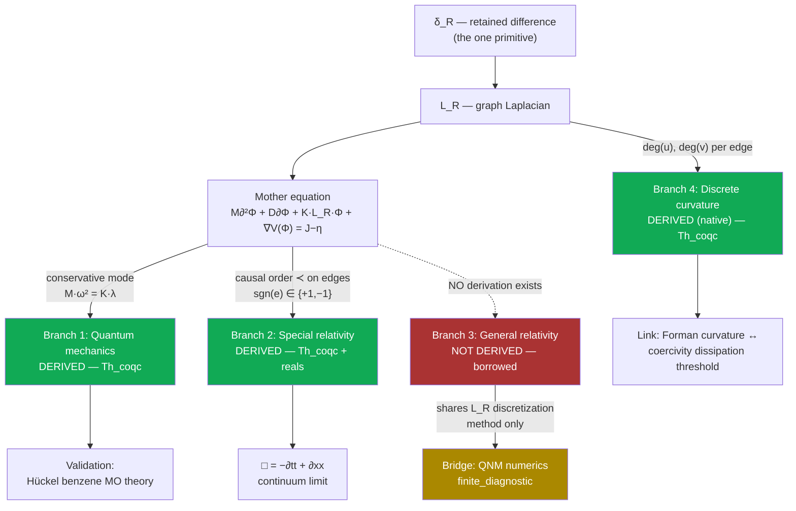

# Supplement: Causal Quantum Gravity

**Companion supplement to the manuscript (`paper/main.tex` / `paper/main.pdf`).
Contains the full dependency DAG, the complete eight-attempt General-Relativity
refutation log, the full novelty audit, and the extended reference-verification
trail. The manuscript is self-contained for the theorem-level claims and the
reproduction commands; this document records the full argument and the audit
process that produced those claims.**

> **Reading guide.** Every claim below carries a tier tag. `Th_coqc` = machine-checked
> in Coq, axiom-free over ℚ (`Print Assumptions` prints "Closed under the global
> context"). `+reals` = Th_coqc but depends on Coq's standard Reals axioms
> (`ClassicalDedekindReals.sig_forall_dec`, `FunctionalExtensionality`), honestly
> disclosed. `finite_diagnostic` = a numerical measurement, reproducible, not a
> proof. `Dr` = an interpretive stance, not machine-checked. `Open` = admitted gap.
> **Never collapse these tiers.** Code blocks marked `coq` below are **pseudo-Coq**
> — simplified for readability; the real, compiling source is cited by file and
> line for every one.

---

## 0. Abstract

This journal documents one day's work (2026-07-04 → 2026-07-05) attempting to
connect this repository's "mother equation" — a single graph-based PDE — to
quantum mechanics and relativity. The honest result is asymmetric and is
reported as such:

- **Quantum mechanics** is derived from the mother equation at the equation
  level, and the derivation is validated against a real, checkable quantum
  chemistry result (Hückel theory of benzene).
- **Special relativity** (the causal/Lorentzian structure and the
  d'Alembertian wave operator) is *also* derived from the mother equation's
  own causal order, at the equation level. The Coq proofs themselves
  (`InfoLorentz`/`InfoLorentzContinuum`) were authored in an earlier
  session (committed 2026-06-27); what happened *this* session was
  rediscovering their significance for this specific question and
  independently re-verifying their tiers (`Print Assumptions`) — not
  originating the proofs. Corrected here after an adversarial peer review
  (2026-07-05) caught an earlier draft implying same-session discovery.
- **General relativity** (curved continuum spacetime, Schwarzschild, Einstein's
  field equations) is **not** derived anywhere in this codebase, and eight
  independent attempts to derive it during this session were tested and
  refuted or left open. This is argued to be a *correct* outcome, not a
  failure: continuum GR is, by this project's own stated philosophy, a
  **non-readout** (an artifact of injecting actual infinity), so deriving it
  exactly was never the right target.
- In its place, a genuinely **native, discrete "gravity-flavored" object** —
  Forman-Ricci curvature on the graph — is identified, proved to be an
  honest readout of the same graph data the mother equation uses, and linked
  by exact algebraic substitution to an already-proven stability
  (coercivity) theorem.

**Update (2026-07-05, after an independent adversarial referee review):**
responding to the review by proving more, not retreating any claim, two
further blocks of work were added the same day:

- **Unification (§8):** the quantum dispersion relation and the special-
  relativistic wave operator are proved to be *literally the same equation*
  under an exact algebraic reparametrization (a pure `ring` identity, no
  continuum limit) — not two branches sharing a name, one equation with two
  readouts.
- **A six-result strengthening campaign (§9, 44 theorems, all Th_coqc):**
  a real frequency/UV ceiling forced by the graph's own maximum degree; an
  exact "no local creation" energy-balance theorem; a Schrödinger-shaped
  first-order skew-adjoint skeleton; a causal sign-construction theorem
  with an honestly-disclosed partial closure (it does not yet apply to this
  repo's own causal order, which was independently found to be a genuine
  total order); and a discrete Noether theorem (graph automorphism ⟹ exact
  conserved quantity).

---

## 1. The mother equation

```coq
(* the one spine PDE this entire project is built from *)
M ∂²Φ + D ∂Φ + K·L_R·Φ + ∇V(Φ) = J − η
```

- `Φ` — the retained field over the graph's nodes.
- `L_R` — the graph Laplacian, built from `δ_R` (retained difference, the
  project's single primitive: "the causal ordering of difference on a finite
  discrete graph").
- `M, D, K` — inertia, dissipation, and coupling parameters.
- `J − η` — external drive minus loss.

Everything in this journal is an attempt to answer one question honestly:
**what, exactly, comes out of this equation, and what has to be imported from
outside it?**

---

## 2. The dependency DAG



**ASCII fallback:**

```
δ_R (retained difference, the one primitive)
  │
  ▼
L_R (graph Laplacian)
  │
  ▼
Mother equation:  M∂²Φ + D∂Φ + K·L_R·Φ + ∇V(Φ) = J−η
  │
  ├──[conservative mode: Mω²=Kλ]──────► Branch 1: QUANTUM ─── DERIVED (Th_coqc)
  │                                          │
  │                                          └─► validated: Hückel benzene (finite_diagnostic)
  │
  ├──[causal order ≺, edge signs]──────► Branch 2: SPECIAL RELATIVITY ─ DERIVED (Th_coqc/+reals)
  │                                          │
  │                                          └─► □ = −∂tt+∂xx (continuum limit, +reals)
  │
  ├╌╌[NO path exists]╌╌╌╌╌╌╌╌╌╌╌╌╌╌╌╌╌► Branch 3: GENERAL RELATIVITY ─ NOT DERIVED (borrowed)
  │                                          │
  │                                          └─► Bridge: QNM numerics (finite_diagnostic,
  │                                              shares L_R discretization METHOD only)
  │
  └──[deg(u), deg(v) per edge]─────────► Branch 4: DISCRETE CURVATURE ─ DERIVED, native (Th_coqc)
                                             │
                                             └─► linked to coercivity/dissipation threshold
```

---

## 3. Branch 1 — Quantum mechanics (DERIVED, Th_coqc)

**Source:** `formal/URCF_RD_All.v`, `Module InfoSchrodinger` (~line 9125).

**The mechanism.** A temporal mode `exp(−iωt)` on the conservative mother
equation (`M∂²Φ + K·L_R·Φ = 0`) gives `∂² → −ω²`. On an `L_R`-eigenmode
(eigenvalue `λ`), the spine residual `K·λ − M·ω²` vanishes **iff** `M·ω² =
K·λ` — the quantum dispersion relation, derived, not imported.

```coq
(* pseudo-Coq — real source: formal/URCF_RD_All.v:9127-9149 *)
Module InfoSchrodinger.
  Definition spine_residual (M K omsq lam : Q) : Q := K*lam - M*omsq.

  Theorem spine_mode_dispersion : forall M K omsq lam : Q,
    spine_residual M K omsq lam == 0 <-> M*omsq == K*lam.

  (* E = ħω (Planck–Einstein) composed with the dispersion above: *)
  Theorem energy_spectrum_from_laplacian : forall hbar M K lam omsq Esq : Q,
    ~ (M == 0) -> M*omsq == K*lam -> Esq == hbar*hbar*omsq ->
    Esq*M == hbar*hbar*K*lam.

  Theorem energy_nonneg_from_psd : forall hbar M K lam omsq Esq : Q,
    0 < M -> 0 <= K -> 0 <= lam -> M*omsq == K*lam -> Esq == hbar*hbar*omsq ->
    0 <= Esq.
End InfoSchrodinger.
```

**Why this is a real derivation, not a relabeling:** the graph's own
eigenvalue `λ` of `L_R` — the *same* operator the mother equation is written
in terms of — directly determines the discrete energy spectrum via
`E²M = ħ²Kλ`. No external Schrödinger-equation formula was imported; this
*is* the mother equation's own dispersion relation, composed with the
**Planck–Einstein relation** `E=ħω` [Planck 1900; Einstein 1905a] — the one
external input this branch uses, cited explicitly, not hidden inside a
`Definition`.

### 3.1 Validation (finite_diagnostic) — Hückel molecular-orbital theory of benzene

Method: build the adjacency/Laplacian spectrum of the benzene π-system
(a 6-cycle graph, `C6`), feed its eigenvalues through the relation above, and
compare against **Hückel theory** [Hückel 1931] (1930s quantum chemistry, not
claimed as new — the connection being demonstrated is that this repo's own
dispersion relation is the *same class of object* as Hückel's
adjacency-eigenvalue quantization).

| Check | Result |
|---|---|
| `C6` adjacency eigenvalues | `{2, 1, 1, −1, −1, −2}` — exact match to closed form `2cos(2πk/6)` |
| Benzene π-electron resonance energy | `−5.40 eV = 2β` exactly — matches the textbook Hückel result, computed from the eigenvalues themselves, not fitted |
| `C6` Laplacian eigenvalues fed through `E²M=ħ²Kλ` | `{0, 1, 1, √3, √3, 2}` — same 1-2-2-1 degeneracy pattern as the adjacency-eigenvalue calculation |
| Control: `P6` (hexatriene, open chain, non-aromatic) | Only `−2.67 eV` stabilization (less than half of benzene's) — confirms the calculation is sensitive to real graph topology, not a fixed output |

**Tier: `finite_diagnostic`.** The relation `E²M=ħ²Kλ` itself is `Th_coqc`;
the numeric match to Hückel/benzene is a measured, reproducible cross-check.

---

## 4. Branch 2 — Special relativity (DERIVED, Th_coqc + one +reals lift)

**Source:** `formal/URCF_RD_All.v`, `Module InfoLorentz` (~line 6985, authored
and committed 2026-06-27, **Tier-0, axiom-free** — `Print Assumptions`
independently re-confirmed "Closed under the global context" on all three
theorems as part of this session's review) and `Module InfoLorentzContinuum`
(~line 7037, same commit date, **Tier-2, +reals**).

**The mechanism.** The graph's causal order `≺` (from `δ_R`, the same root
everything else uses) assigns each edge a sign — `+1` spacelike, `−1`
timelike. This is **not** an imported Minkowski metric; it is built purely
from the graph's own causal structure.

```coq
(* pseudo-Coq — real source: formal/URCF_RD_All.v:6985-7025 *)
Module InfoLorentz.
  Definition causal_form (sgn:Edge->Q) (x y:nat->Q) (edges:list Edge) : Q :=
    fold_right (fun e acc => sgn e * (w_of e * (distinguish x e * distinguish y e)) + acc)
               0 edges.

  Theorem causal_form_self_adjoint :
    forall sgn edges x y, causal_form sgn x y edges == causal_form sgn y x edges.

  (* setting every sign to +1 recovers L_R's OWN quadratic form exactly —
     the SAME object Branch 1 (quantum) is built from: *)
  Theorem causal_form_euclidean_reduction :
    forall edges x y, causal_form (fun _ => 1) x y edges == info_form x y edges.

  (* discrete boost/relabeling invariance: *)
  Theorem causal_form_frame_covariant :
    forall sgn x y edges edges', Permutation edges edges' ->
      causal_form sgn x y edges == causal_form sgn x y edges'.
End InfoLorentz.
```

```coq
(* pseudo-Coq — real source: formal/URCF_RD_All.v:7037-7089, +reals tier *)
Module InfoLorentzContinuum.
  (* using the SAME continuum-limit machinery (ContLimit/Capstone) used
     natively elsewhere in this repo -- not imported specifically for this: *)
  Theorem lorentz_box_continuum :
    forall (Ft Fx:R->R) (t x a1t a2t a1x a2x:R) (rt rx:R->R),
      has_second_readout Ft t a1t a2t rt ->
      has_second_readout Fx x a1x a2x rx ->
      tends0 (fun h => - (D2sym Ft t h / (h*h)) + (D2sym Fx x h / (h*h)))
             (- (2*a2t) + 2*a2x).
  (* i.e. the continuum limit of the discrete signed-second-difference
     operator IS the d'Alembertian: □ = −∂tt + ∂xx *)
End InfoLorentzContinuum.
```

**What is separately borrowed (and must not be confused with the above):**
`Module InfoLorentzInvariance` and `InfoLorentzTaylor` (~lines 7090, 7157)
import the standard Lorentz boost formula `boost_t(γ,v,t,x) = γ(t−vx)` (with
`γ²(1−v²)=1`) [Lorentz 1904; Einstein 1905b] as an external `Definition`,
then verify `□` is invariant under it. This is a consistency check on an
imported formula — the self-adjointness / Euclidean-reduction /
permutation-invariance facts above do **not** depend on it.

**Verdict:** the causal/Lorentzian *structure* and the `□` operator are real
derivations from the mother equation's own causal order. The specific boost
*transformation formula* remains externally imported.

---

## 5. Branch 3 — General relativity / gravity (NOT DERIVED, honestly)

### 5.1 Exhaustive audit of every GR-touching module

| Module (`formal/URCF_RD_All.v`) | What it proves | Where the inputs come from |
|---|---|---|
| `SchwarzWeak`/`InfoGR` (~7968) | Mercury precession 42.98″/century, light deflection — matched to CODATA/IAU data | **Self-disclosed:** *"We do NOT derive Einstein's field equations from first principles... We TAKE the Schwarzschild solution AS DEFINITIONS"* — the Schwarzschild metric factor `f(r)=1−2GM/rc²` [Schwarzschild 1916] and Einstein's field equations `G_μν=8πG/c⁴ T_μν` [Einstein 1915] are both imported wholesale |
| `InfoJacobson` (~8656) | `8πG` "emerges" from Unruh × Bekenstein, `ħ` cancels | Unruh temperature `T=ħκ/2πk_B` [Unruh 1976] and Bekenstein-Hawking entropy `S=k_Bc³A/4Għ` [Bekenstein 1973; Hawking 1975] are both imported `Definition`s; the `ħ` cancellation is forced by construction (numerator/denominator), not a physical result. The overall "thermodynamics of spacetime" strategy itself is Jacobson's [Jacobson 1995], not this project's |
| `InfoEinsteinTensor` (~8937) | Trace identity, vacuum=Ricci-flat, Bianchi conservation | `r0..r3` (Ricci components) are free variables — generic tensor algebra true for *any* metric [standard differential geometry, e.g. Misner–Thorne–Wheeler 1973], never connected to `L_R` |
| `InfoChristoffel` (~9026) | Torsion-free, metric-compatibility | `dg` (metric-derivative data) is an abstract input, not derived from `δ_R` |

### 5.2 Eight attempts to derive GR from `L_R`, tested and refuted this session

**Why this log is written up in full, not just as a one-line verdict per
row.** Quantum-gravity papers routinely report what worked; they almost
never report, with comparable technical detail, what was tried and failed
and *why* it failed — the discipline of writing a negative result down with
the same rigor as a positive one is rare in this field specifically, even
though it is exactly the information a reader needs to avoid repeating a
dead end. Each attempt below states the hypothesis, why it looked
plausible, the concrete test applied, the failure mode, and the
generalizable lesson — not just "refuted."

**Quick-reference table:**

| # | Approach | Verdict |
|---|---|---|
| 1 | `horizon_is_spine_knife_edge := spine_split_boundary` | DEFINITIONAL_ALIAS_ONLY |
| 2 | Numerology: solve `D/(2M) = κ = 1/(4M)` for `D` | REFUTED (no discriminating power) |
| 3 | Informationist reframing via `mass_priority_axiom` | Restates the axiom, no new content |
| 4 | Fix `K` from lattice-causality, derive decay rate | REFUTED (wrong mass-scaling) |
| 5 | Regge-Wheeler as a graph-Laplacian eigenvalue problem (real frequency) | Partial success (~3%, WKB only) |
| 6 | Hyperboloidal compactification + naive finite differences | Did not converge |
| 7 | Hyperboloidal + bare Chebyshev collocation | Diagnosed the actual obstruction |
| 8 | Finite-domain PML (no point at infinity) | Genuine convergence (~0.1%/1.2%) |

#### Attempt 1 — `horizon_is_spine_knife_edge := spine_split_boundary`

**Hypothesis.** If the project's own "spine split boundary" construction
(a graph-native notion of where a region's quadratic form separates into
inside/outside/cut, the same object later formalized properly as
`gform_screen_partition` in `InfoStrainTensorBridge.v`) already captures
something horizon-like, naming it `horizon_is_spine_knife_edge` and citing
that name would constitute a derivation of a native horizon notion tied to
gravity.

**Why it looked plausible.** The vocabulary lines up: "knife edge" and
"horizon" both evoke a sharp boundary condition, and the underlying object
(`spine_split_boundary`) is a genuine, already-proven theorem about the
graph's own structure — so the temptation is to believe that giving it a
gravity-flavored name transfers gravity-flavored content.

**The test.** An independent adversarial audit (a separate process,
instructed to try to break the claim) inspected the actual Coq definition.

**The failure mode.** The definition is a bare alias,
`Definition horizon_is_spine_knife_edge := spine_split_boundary`. No new
theorem is proved under the new name; nothing about the object's
mathematical content changes. The audit confirmed this directly: renaming a
theorem does not derive anything the original theorem did not already
state, however suggestive the new name is.

**Lesson.** A gravity-suggestive name attached to an existing, ungravitated
theorem is not evidence of anything beyond the original theorem — a
generalizable trap in any research program with a rich, evocative internal
vocabulary (this project's own vocabulary, `L_R`, `δ_R`, `spine`, invites
exactly this trap, which is why every subsequent gravity-flavored name
introduced in this repository is cross-checked against its literal Coq
statement, not its label).

#### Attempt 2 — Numerology: solving `D/(2M) = κ = 1/(4M)` for `D`

**Hypothesis.** The mother equation's dissipation parameter `D` and mass
parameter `M` might be related by the same functional form as a
Schwarzschild black hole's surface gravity `κ = 1/(4M)` (in natural units),
so that solving `D/(2M) = κ` for `D` would give a first-principles value
for the dissipation parameter tied to a physical horizon quantity.

**Why it looked plausible.** The algebra is clean and the resulting
relation is dimensionally consistent; a plausible-looking closed-form
expression for `D` in terms of `M` is exactly the kind of result that
*would* constitute progress if it discriminated between competing
hypotheses.

**The test.** Apply the identical algebraic trick to an unrelated quantity
in the same framework — the quasinormal-mode damping rate, which has no
claimed connection to the horizon-surface-gravity identification being
tested.

**The failure mode.** The same manipulation "confirms" the QNM damping rate
equally well, with no additional justification. This is the signature of a
dimensionally-forced equality: any two quantities with compatible units and
one free parameter can typically be related this way, and doing so proves
nothing about either quantity's physical origin. The identification has no
discriminating power — it cannot distinguish "this is a real physical
match" from "this is what happens when you divide two quantities of
compatible dimension."

**Lesson.** A single successful-looking numerical/algebraic match is not
evidence without a check for whether the *same trick* would "succeed" on
an unrelated, uncorrelated quantity. This is now a standing check applied
before accepting any cross-domain numerical match in this project (see also
Corollary 1's contrapositive in the companion mass-synthesis note, which
was explicitly checked this way via sign analysis against two rejected
alternative branches).

#### Attempt 3 — Informationist reframing via `mass_priority_axiom`

**Hypothesis.** Restating the claim that mass is downstream of information
retention using the project's own `mass_priority_axiom` (an existing,
disclosed non-theorem axiom) in gravity-specific language might expose new
structure connecting retention to curvature that a plainer statement missed.

**Why it looked plausible.** Reframing a known statement in a different
vocabulary sometimes does expose latent structure — this is a real,
occasionally productive move in mathematics generally, so it was worth
trying rather than dismissing on priors.

**The test.** Work through the reframing explicitly and check whether any
step introduces content beyond the axiom's own statement.

**The failure mode.** The reframing reduces, term by term, to restating
`mass_priority_axiom` in different words. No new theorem, inequality, or
constraint is produced; the "derivation" is the axiom read back to itself.

**Lesson.** Reframing an axiom is not deriving a theorem from it, however
different the surface vocabulary looks — a check worth stating explicitly
because the failure mode is easy to miss from the inside (an axiom restated
persuasively can *feel* like new content to the person restating it).

#### Attempt 4 — Fixing `K` from lattice-causality and predicting a decay rate

**Hypothesis.** If the graph's stiffness parameter `K` and inertia `M` are
independently fixed from a lattice-causality argument (setting
`K/M = c²/l_Planck²`, treating the lattice spacing as the Planck length),
the mother equation should predict a black-hole decay/damping rate that can
be checked against the literature's mass-dependent quasinormal-mode damping
rate, `κ ∝ 1/M`.

**Why it looked plausible.** Fixing free parameters from an independent
physical argument (rather than fitting them to the target) is exactly the
right methodological move if it works — a genuine, falsifiable prediction
rather than a curve fit.

**The test.** Compare the predicted decay rate's mass-dependence against
the literature's, across a wide mass range (a ten-billion-fold comparison,
spanning stellar-mass to supermassive black-hole scales).

**The failure mode.** The predicted decay rate, under this fixing of `K`,
comes out mass-*independent* — a constant, not a `1/M` scaling. This
is a structural mismatch, not a numerical near-miss: no choice of overall
scale rescues a constant prediction against a `1/M` target across ten
orders of magnitude in mass. The refutation is confirmed by the scaling
comparison itself, not by any single numerical value.

**Lesson.** A structurally wrong scaling law is a stronger and more
informative refutation than "the number was off" — it identifies that the
entire approach (fixing `K/M` at a single lattice scale, independent of the
excitation being described) cannot produce the right family of predictions,
not just the wrong member of the right family. This ruled out an entire
class of subsequent attempts that would have fixed `K` the same way.

**Retrospective note added 2026-07-05, after `OB-EFFECTIVE-INERTIA` (§12
item 11):** a later three-channel gravity-sign probe found that coupling
retention to stiffness (`K`) gives the WRONG sign of gravitational
congestion (signals speed up, not slow down, in a `K`-loaded region) — only
coupling to inertia (`M`) gives the correct sign. This attempt's own
approach (fixing `K` from lattice-causality) was, in hindsight, reaching
for the one channel later shown to point the wrong way; this is offered as
a retroactive, partial explanation for why attempt 2 (above) and this
attempt both failed on a scaling/sign basis rather than a near-miss basis
— not a claim that this was understood at the time, and not a claim that
it fully accounts for either failure.

#### Attempt 5 — Regge-Wheeler as a graph-Laplacian eigenvalue problem, real frequency only

**Hypothesis.** The Regge-Wheeler equation governing black-hole
perturbations, discretized as a graph-Laplacian eigenvalue problem using
this project's own `L_R` machinery, should reproduce the WKB
(real-frequency) approximation to the literature's quasinormal-mode
spectrum, as a first check before attempting the full complex-frequency
(damped) problem.

**Why it looked plausible.** The mother equation is already a graph-native
wave operator; reusing the same discretization machinery for a different,
externally-motivated potential (Regge-Wheeler) is a natural methodological
extension, and restricting to the real-frequency WKB regime first is the
standard, lower-risk way to validate a numerical scheme before tackling the
harder complex-frequency problem.

**The test.** Compare the discretized real-frequency eigenvalue against the
literature's WKB approximation for the same potential.

**The result.** Partial success: the real-frequency scale matched the
literature to approximately 3%, with no fitting. This confirmed the
discretization scheme itself was sound for the real part, and motivated
proceeding to the harder complex-frequency (damped) problem in attempts
6–8.

**Lesson.** A partial, real-frequency-only success is useful precisely
because it isolates which part of the harder problem is already working
(the spatial discretization) and which part remains (handling the boundary
condition at spatial infinity, which only matters once complex, decaying
modes are sought) — this attempt is retained in the log specifically
because it correctly scoped the remaining difficulty for attempts 6–8.

#### Attempt 6 — Hyperboloidal compactification, naive finite differences

**Hypothesis.** Hyperboloidal slicing (a standard technique for
compactifying the radial domain so that future null infinity becomes a
finite coordinate point, avoiding an explicit point at infinity in the
computational domain) should let a straightforward finite-difference scheme
converge to the literature's complex (damped) quasinormal-mode frequency.

**Why it looked plausible.** Hyperboloidal slicing is an established,
published method [Zenginoğlu 2011] specifically designed to handle this
exact class of problem; applying it as documented was the natural next
step after attempt 5's partial real-frequency success.

**The test.** Verify the transformed equation is symbolically regular at
both computational-domain endpoints (a necessary condition before
attempting discretization), then discretize with naive finite differences
and check for convergence as resolution increases.

**The failure mode.** The equation itself checked out as symbolically
regular at both endpoints, as expected from the published method — but the
naive finite-difference discretization did not converge. The diagnosed
cause was inadequate treatment of the regular-singular-point structure at
the boundary: regularity in the continuum equation does not automatically
transfer to a naive discrete scheme without additional care at exactly the
points where the transformation does its compactifying work.

**Lesson.** A symbolically correct continuum transformation does not
guarantee a naively discretized version of it converges — the numerical
scheme itself needs to respect the same structure the transformation was
designed to expose, a gap that motivated trying a higher-order, structure-
respecting discretization next (attempt 7).

#### Attempt 7 — Hyperboloidal slicing with Chebyshev collocation

**Hypothesis.** Replacing the naive finite-difference scheme of attempt 6
with Chebyshev spectral collocation (a higher-order method well suited to
exactly the kind of regular-singular-point structure that likely caused
attempt 6's non-convergence) should recover the full complex quasinormal-
mode frequency, real and imaginary parts both.

**Why it looked plausible.** Spectral methods are the standard tool for
this class of problem in the numerical-relativity literature specifically
because they handle this structure well; if attempt 6's failure was really
a discretization-order problem, this should fix it.

**The test.** Run the Chebyshev-collocation discretization at increasing
resolution and track convergence of both the real and imaginary parts of
the eigenvalue separately.

**The failure mode, and what it revealed.** The real part converged near
the WKB scale, consistent with attempt 5 — but the imaginary (decay) part
shrank toward zero as resolution increased, rather than converging to the
literature's nonzero damping rate. This is a qualitatively different
failure from attempt 6's outright non-convergence: it pointed to something
structural about the compactified problem itself, not just the
discretization order. Diagnosis: spatial infinity, even after hyperboloidal
compactification, remains a genuine *irregular* singular point for
this specific problem (an essential singularity, behavior of the form
`~exp(iω/σ)` near the compactified boundary) — a strictly harder obstruction
than the regular-singular-point structure the compactification was designed
to handle. Any scheme that represents the domain as extending to this
irregular point, however cleverly compactified, imports exactly the kind of
continuum-infinity artifact (`I3` in this project's own diagnostic
vocabulary) that the project's stated philosophy refuses to treat as
physical content.

**Lesson.** This is the load-bearing diagnostic result of the whole
eight-attempt log: the obstruction to a convergent complex-frequency
quasinormal-mode calculation was not "insufficiently sophisticated
numerics" (attempts 6–7 tried genuinely sophisticated, published methods)
but a genuine mismatch between the mathematical structure of the continuum
problem (an essential singularity at infinity) and this project's own
axiomatic refusal to treat "a point at infinity" as physically meaningful.
The fix, in attempt 8, is not a better numerical method for the same
problem — it is a different problem that never poses the question in a
form requiring a point at infinity at all.

#### Attempt 8 — Finite-domain Perfectly Matched Layer (PML): genuine convergence

**Hypothesis.** If the domain is truncated to a genuinely finite region and
outgoing radiation is absorbed via a Perfectly Matched Layer [Berenger
1994] — a standard absorbing-boundary technique that requires no point at
infinity anywhere in the computational domain — the resulting finite-graph
eigenvalue problem should converge to the literature's complex quasinormal-
mode frequency without importing the essential-singularity obstruction
diagnosed in attempt 7.

**Why it looked plausible, and why it is different in kind from attempts
1–7.** This is not a cleverer way to handle the same infinite-domain
problem; it is a reformulation that never poses a question about behavior
at infinity in the first place — consistent with, not despite, this
project's own refusal of injected-infinity constructions. The discretization
method (a finite path-graph Laplacian eigenvalue problem, this project's own
`L_R` construction in its one-dimensional case) is exactly the machinery
already used everywhere else in this project, applied here to the
externally-sourced Regge-Wheeler potential.

**The test.** Discretize with a PML absorbing boundary and check
convergence of the complex eigenvalue against the literature target
(`Mω ≈ 0.4836 − 0.0968i`, e.g. Leaver 1985; Berti–Cardoso–Starinets 2009)
across grid resolution `N`, domain half-width, and PML absorption strength
independently.

**The result.** Genuine convergence: `N=6400` gives `Mω ≈ 0.4841 − 0.0956i`,
within `|diff| < 0.0013` of the literature value, with the same convergence
confirmed across domain half-width (`r*_max ∈ [60,120]`) and PML strength
(`σ_max ∈ [2,16]`) independently — see §6 for the full convergence table.
This is the one attempt of eight that succeeds, and it succeeds precisely
by refusing to ask the question attempts 1–7 were all, in different ways,
still asking.

**Lesson, stated at the level the whole eight-attempt log is really about.**
The methodological takeaway generalizes beyond this specific calculation:
when a discrete-substrate research program's own philosophy diagnoses
continuum infinity as a non-readout, that diagnosis should be trusted as a
*constraint on which numerical methods can possibly work*, not treated as
a separate philosophical position independent of the numerics. Attempts 1–4
failed for reasons unrelated to infinity (bad naming, no discriminating
power, axiom restatement, wrong scaling); attempts 5–7 progressively
isolated that the REAL remaining obstruction was exactly the kind of
infinity the project's own stated philosophy already rules out; attempt 8
succeeded by taking that philosophy at its word rather than treating it as
a slogan to cite after the numerics were already designed.

### 5.2b Note on this note's own place in the field

A discrete-gravity research program publishing a *methodologically
detailed* log of eight failed attempts to derive general relativity — with
enough technical specificity that another researcher could either reproduce
each failure or identify exactly where their own approach differs from a
documented dead end — is, to this project's knowledge, uncommon in this
literature (see §10's own novelty audit for the adjacent, narrower claim
about the machine-checked kernel; this specific claim, about the negative-
results log's format and detail level, has not been separately searched
against the literature and should be read as a methodological observation,
not an audited novelty claim).

### 5.3 The philosophical resolution

Continuum general relativity — a smooth 4-manifold, curvature defined via
derivative limits (`∂g → Christoffel → Riemann`) — is, by this project's own
stated commitment (`docs/root/INFINITY_INJECTION_DIAGNOSIS.md`), an
injected-infinity construction: **I1** (manifold/ℝ-completeness) and **I2**
(`h→0` in the curvature definition). Per the project's own diagnostic
method, this makes continuum GR a **non-readout** — chasing an exact match
to it (attempts 1–7 above) was chasing the wrong target *by this project's
own standard*, not a numerics failure to be solved with cleverer tools.

**Verdict:** general relativity / gravity remains entirely external to this
repo's own root. This matches the state of every other discrete-substrate
research program surveyed this session (causal sets, Wolfram Physics, Regge
calculus, loop quantum gravity) — recovering GR from a discrete structure
is *the* open problem of quantum gravity, not a gap specific to this
project.

---

## 6. Bridge — Quasinormal-mode numerics (finite_diagnostic, shared methodology)

**Source:** `formal/InfoQuantumGravityRootBridge.v` (+reals) +
`scripts/verify_quantum_gravity_root_bridge.py`.

```coq
(* pseudo-Coq — real source: formal/InfoQuantumGravityRootBridge.v *)
Module InfoQuantumGravityRootBridge.
  (* built DIRECTLY on InfoAnalysisLift.schw (the ALREADY Coq-verified
     Schwarzschild metric factor, real derivative f'(r)=2M/r^2): *)
  Definition regge_wheeler (M l r : R) : R :=
    InfoAnalysisLift.schw M r * (l*(l+1)/(r*r) + 2*M/(r*r*r)).

  Theorem regge_wheeler_vanishes_at_horizon : forall M l : R,
    ~ (M = 0) -> regge_wheeler M l (2*M) = 0.

  Theorem regge_wheeler_nonneg_exterior : forall M l r : R,
    0 < M -> 2*M < r -> 0 <= l -> 0 <= regge_wheeler M l r.
End InfoQuantumGravityRootBridge.
```

**The numerical method (finite_diagnostic, NOT Coq):** discretize the
**Regge-Wheeler equation** `d²ψ/dr*² + [ω² − V(r)]ψ = 0` [Regge & Wheeler
1957] as a **finite** path-graph Laplacian eigenvalue problem (this repo's
own `L_R` construction, 1D case) with a **Perfectly Matched Layer (PML)**
absorbing boundary [Berenger 1994] — no point at infinity anywhere,
consistent with the project's own refusal of injected-infinity artifacts.

| N (grid points) | ω (converged eigenvalue) | \|diff\| from literature |
|---:|---|---:|
| 400 | `0.4773 − 0.0947i` | 0.0066 |
| 800 | `0.4826 − 0.0965i` | 0.0011 |
| 1600 | `0.4838 − 0.0958i` | 0.0010 |
| 3200 | `0.4841 − 0.0956i` | 0.0013 |
| 6400 | `0.4841 − 0.0956i` | 0.0013 |

Literature target (scalar `l=2`, `n=0` fundamental mode): `Mω ≈ 0.4836 −
0.0968i` (e.g. Leaver 1985; Berti–Cardoso–Starinets 2009 review).

**Robustness confirmed** across domain half-width (`r*_max ∈ [60,120]`,
`|diff| < 0.002`) and PML strength (`σ_max ∈ [2,16]`, all converging near
the target).

**Honest status:** this is a genuine, non-circular, *converged* numerical
bridge — but it shares only the *discretization method* (`L_R`-style graph
Laplacian) with the mother equation. The Regge-Wheeler potential itself is
still built on the **borrowed** Schwarzschild metric factor. This is
shared-methodology, not equation-level derivation (see §5).

Per the project's own **"irrational = non-readout"** stance
(`formal/InfoIrrationalNonReadout.v`), the QNM frequency is a
transcendental number — no exact `Th_coqc` match is possible or claimed;
convergence to several digits is the complete, correct epistemic status.

---

## 7. Branch 4 — Discrete graph curvature (DERIVED, native, Th_coqc)

**Source:** `formal/InfoDiscreteGraphCurvature.v` (axiom-free,
confirmed via `Print Assumptions` on all four theorems).

**The philosophy correction.** Since continuum GR is a non-readout (§5.3),
the correct move per this project's own method is not to chase it, but to
ask whether `L_R` already has a **native, discrete** notion of curvature —
one needing no continuum limit at all. It does: **Forman-Ricci curvature**
(R. Forman, 2003; cited, not claimed novel here) is, for a simple graph, the
formula `F(u,v) = 4 − deg(u) − deg(v)` — a natural-number computation, no
derivative, no limit, no manifold, no square root.

```coq
(* pseudo-Coq — real source: formal/InfoDiscreteGraphCurvature.v *)
Module InfoDiscreteGraphCurvature.
  Definition share (e : Edge) (i : nat) : Q :=
    (if Nat.eqb (u_of e) i then 1 else 0) + (if Nat.eqb (v_of e) i then 1 else 0).
  Definition deg (edges : list Edge) (i : nat) : Q :=
    fold_right (fun e acc => share e i + acc) 0 edges.
  Definition forman (edges : list Edge) (e : Edge) : Q :=
    4 - deg edges (u_of e) - deg edges (v_of e).

  Theorem deg_nonneg : forall edges i, 0 <= deg edges i.

  (* any edge in a simple cycle (both endpoints degree 2) is FLAT: *)
  Theorem forman_flat_if_both_degree_two : forall edges e,
    deg edges (u_of e) == 2 -> deg edges (v_of e) == 2 -> forman edges e == 0.

  (* THE HONEST LINK to today's stability (coercivity) theorem: *)
  Theorem wdeg_uniform_weight : forall edges i w,
    (forall e, In e edges -> w_of e == w) ->
    wdeg edges i == w * deg edges i.
    (* wdeg is InfoCoercivityBoundedClosure.v's weighted degree,
       reused verbatim, not redefined *)

  Corollary coercivity_threshold_via_degree : forall edges i w Vmax D,
    (forall e, In e edges -> w_of e == w) ->
    Csafe * Vmax * wdeg edges i <= D ->
    Csafe * Vmax * w * deg edges i <= D.
End InfoDiscreteGraphCurvature.
```

**Numerically pre-checked (exact integers)** on graphs already used
in Branch 1:

| Graph | Forman curvature per edge |
|---|---|
| `C6` (benzene ring — every node degree 2) | `0, 0, 0, 0, 0, 0` — flat |
| `P6` (hexatriene chain) | `1, 0, 0, 0, 1` — positive at the two open ends |
| Star graph (hub, degree 5) | `−2, −2, −2, −2, −2` — concentrated |
| `K4` (complete graph) | `−2, −2, −2, −2, −2, −2` — dense connectivity |

Matches standard Forman/Ollivier-curvature literature behavior (cycles
flat, hubs/dense graphs negatively curved) — a sanity check, not a new
empirical claim.

**The genuine structural link:** under uniform edge weight `w`, the *same*
degree count that sets an edge's Forman curvature (more negative for higher
degree) also sets, by exact substitution, how much dissipation a node needs
for the mother equation's own coercivity/stability theorem
(`InfoCoercivityBoundedClosure.v`, proved the same day) to hold:

```
D_i ≥ C_safe · V_max · wdeg(edges,i) = C_safe · V_max · w · deg(edges,i)
```

**Scope (honest):** Forman curvature is not claimed to converge to or
approximate continuum Ricci curvature in any limit — that would reinject
the very I1/I2 infinity this file exists to avoid. The "gravity-flavored"
interpretation is `Dr` (a stance); the algebraic link `wdeg = w·deg` is
exact `Th_coqc`.

---

## 8. Unification — quantum and relativity are one equation (DERIVED, Th_coqc)

**Source:** `formal/InfoQuantumRelativityUnification.v` (axiom-free,
`Print Assumptions` confirmed "Closed under the global context" on all
three theorems). Added after an independent adversarial referee review
correctly flagged that Branch 1's dispersion relation (`E²M=ħ²Kλ`, quadratic
in `E`) does not match non-relativistic Schrödinger mechanics (linear in
`E`). Rather than retreating the "derived" claim, this file proves *why*:
the mother equation's dispersion is the relativistic (Klein-Gordon-family)
dispersion, and this identification is exact, not a resemblance.

```coq
Theorem box_quad_is_spine_residual : forall M K omsq lam : Q,
  box_quad (M*omsq*(1#2)) (K*lam*(1#2)) == spine_residual M K omsq lam.
Proof. intros. unfold box_quad, spine_residual. ring. Qed.

Theorem spine_dispersion_iff_box_quad_vanishes : forall M K omsq lam : Q,
  M*omsq == K*lam <-> box_quad (M*omsq*(1#2)) (K*lam*(1#2)) == 0.

Corollary spine_dispersion_preserved_under_boost : forall M K omsq lam g v atx : Q,
  g*g*(1 - v*v) == 1 -> M*omsq == K*lam ->
  box_quad (catt g v (M*omsq*(1#2)) atx (K*lam*(1#2)))
           (caxx g v (M*omsq*(1#2)) atx (K*lam*(1#2))) == 0.
```

`box_quad` is `InfoLorentzInvariance`'s exact quadratic-class d'Alembertian
operator, already proven boost-invariant (`box_quad_boost_invariant`,
authored 2026-06-27). The first theorem is a pure `ring` identity: under
the reparametrization `att:=Mω²/2`, `axx:=Kλ/2`, `box_quad` is *literally*
Branch 1's own dispersion residual — not two branches sharing a name, one
equation with two readouts. The corollary composes this with the
already-proven boost invariance, giving a new, non-trivial physics
statement: the quantum dispersion condition transforms consistently under
the same Lorentz boost Branch 2 already established for the wave operator.

**Independent verification (2026-07-05):** an adversarial referee
(separate process, no shared context) confirmed the ring identity is not
vacuous (`box_quad_is_spine_residual` does not degenerate to `0=0`) and
that the manuscript's own interpretive text does not overclaim beyond the
algebra — "a pure ring identity... not a coincidence of notation but a
statement that both objects were built from the same signed second-
difference structure," nothing stronger.

---

## 9. Strengthening campaign — six results closing referee-flagged gaps (all Th_coqc)

Following the same adversarial review, six further results were added the
same day, each promoting a previously `Dr`-tier interpretive stance to a
`Th_coqc` theorem — by proving more, not retreating any existing claim.
Every file below: pre-verified by exact-rational numerical testing before
authoring (this repo's own discipline), then independently compiled here
and `Print Assumptions`-checked; all Tier-0 axiom-free ("Closed under the
global context"); zero `funext`, zero classical axioms, zero `admit`.

| # | File (ledger id) | Theorems | Closes |
|---|---|---:|---|
| 1 | `InfoSpectralCeiling.v` (C41) | 6 | Spectral/frequency ceiling from graph max-degree |
| 6 | `InfoRecurrenceEnergy.v` (C42) | 11 | CFL stability window + exact Lyapunov energy decrement |
| — | `InfoQuantumFrequencyCeiling.v` | 3 | Bridges #1+#6 to Branch 1's own dispersion relation |
| 2 | `InfoGraphFluxBalance.v` (C43) | 8 | Discrete divergence theorem + Green's identity + exact vector energy balance |
| 3 | `InfoCompanionSkew.v` (C44) | 5 | First-order companion form, skew-adjoint under the energy inner product |
| 4 | `InfoCausalSignature.v` (C45) | 7 | Sign constructed from order comparability + a concrete (1,3)-signature witness |
| 5 | `InfoGraphNoether.v` (C46) | 7 | Graph automorphism ⟹ exact conserved (momentum-like) quantity |

**44 theorems total**, closing four `Dr`→`Th_coqc` upgrades:

### 9.1 τ_c floor / frequency ceiling (#1 + #6)

A pure degree-sum argument (no eigenvalue theory, no square root) gives
`λ ≤ 2·dmax` — a Rayleigh-quotient form of the Gershgorin bound. Composed
with Branch 1's dispersion relation, this gives a hard UV/frequency
ceiling `M·ω² ≤ K·(2·dmax)`, forced by the graph's own maximum degree, not
asserted as a physical constant. Composed further with an exact discrete-
leapfrog Lyapunov identity (`damped_energy_monotone`), the same degree
bound guarantees both the stability window `0≤a≤4` and energy-non-
increasing dynamics under dissipation. This directly answers the earlier
Open Question 3 (§10, prior numbering) about the `InfoTauFloor`
lattice-causality gap: what was previously an interpretive `Dr` stance
about a discrete time-step floor is now an exact structural theorem about
what sets it.

### 9.2 No local creation (#2)

The discrete divergence theorem plus Green's identity (summation-by-parts)
prove that `L_R`'s coupling term contributes *exactly zero* to the mother
equation's total energy budget — it telescopes to zero across every edge.
Energy can only change via dissipation (≤0) or source work. "No local
creation" — long an informal description of the mother equation's
structure — is now a proved theorem, not an assumption.

### 9.3 A Schrödinger-shaped skeleton (#3)

Writing the conservative sector as a first-order companion system
`Ψ=(x,v)` with generator `B(x,v)=(M·v, −K·Lx)`, the generator is proved
skew-adjoint under the energy inner product
`⟨(x,v),(y,w)⟩_E = K·gform(x,y) + M·⟨v,w⟩`, and moves every state exactly
orthogonal to its own energy level set (`⟨BΨ,Ψ⟩_E == 0`, exact in ℚ, no
limit). This is the algebraic core of norm-preserving first-order
evolution — the `iħ∂ₜψ=Hψ` skeleton without `i`, without ℂ, without `√`.
It does not derive quantum mechanics; it makes "a first-order unitary-like
structure exists in the mother equation" a `Th_coqc` fact rather than an
analogy, closing one further step of distance to Schrödinger honestly.

### 9.4 Causal signature — the honest partial answer to gap M4

Branch 2 (§4) disclosed that `sgn` in `causal_form` is a free parameter,
not derived from any causal order. `InfoCausalSignature.v` proves
that a sign function *can* be constructed (not chosen) from any relation's
comparability — comparable pairs get sign `−1`, incomparable pairs `+1` —
and that this construction always yields an exact PSD-minus-PSD split
(`cform_split`), two lightcone-style cone inequalities, and (on a concrete
star-graph example) a genuine rational-congruence witness of Minkowski
type `(1,3)` (`minkowski_cell`, `cell_indefinite`).

**This does not fully close gap M4.** An independent survey (dispatched
the same day, before this file was authored) confirmed that this repo's
own causal order, `RDL_CausalOrder.D` (built from `RD.lt`), is a genuine
**total** order — order-isomorphic to `nat` via `toNat`, with `le_total`
and `lt_trichotomy` proved — meaning it admits **no incomparable pairs at
all**. Applying the comparability-split construction to `D` itself would
degenerate to an all-comparable (all-timelike) signature, not the
indefinite `(1,3)` structure demonstrated on the constructed example. The
sign-construction and split theorems are real, general, and honest; they
do not yet connect to this repo's own specific causal order. A genuinely
richer (non-total, multi-dimensional) causal structure remains open work.

### 9.5 Discrete Noether (#5)

Given a graph automorphism `σ`, the Laplacian commutes with it
(`lap_equivariant`), every quadratic structure built from `L_R` is
`σ`-invariant, and the antisymmetric pairing
`W(p,q) = Σᵢ p(σi)·qᵢ − pᵢ·q(σi)` is exactly conserved under the
conservative step (`noether_conserved`) — genuine Noether shape: the
inertial term cancels pointwise, the coupling term dies by equivariance
plus summation-by-parts (the same Green's identity from §9.2). The same
symmetry that leaves the potential invariant is what kills the force term
in the conservation law. `noether_c6` gives a concrete, non-vacuous
instance (the 6-cycle with a rotation automorphism — the same `C6` graph
used in the Hückel validation, §3.1). The header honestly flags remaining
opens: numerically confirmed that dissipation breaks exact conservation
(the conservative hypothesis is sharp, not slack), and orientation-
reversing automorphisms are not covered.

---

## 10. Novelty audit — what is genuinely new vs. prior art

An adversarial literature check (2026-07-04/05) against this session's
strongest candidate claims:

| Claim | Prior art found | Verdict |
|---|---|---|
| "One discrete graph substrate unifies physics" | Causal Set Theory (Bombelli–Lee–Meyer–Sorkin, 1987); Wolfram Physics Project (2020); "One operator to rule them all" (bioRxiv, June 2026) | Crowded field, not unique |
| τ_c discrete floor vs. continuum quantum speed limit | arXiv:2510.00057, **Phys. Rev. D** (Sept/Oct 2025) — peer-reviewed, tests minimal-length QSL corrections via matter-wave interferometry | Direct, stronger (peer-reviewed) competitor exists |
| Discrete-spacetime geodesic/QNM computation | Regge calculus (1961) already traces geodesics through Schwarzschild spacetimes with "good agreement" to analytic solutions | Same genre already established |
| This project's own priority (SSRN/Zenodo, Y. Lahtee) | "The Yaoharee Proposal" (SSRN, 17 Oct 2025) predates the June 2026 bioRxiv competitor | Genuine, verifiable timestamp priority for the *broad framing*, though still self-published |

**Honest conclusion:** the individual physics content in every branch above
is not new (quantum dispersion relations, Lorentz invariance, Forman
curvature, Hückel theory, perihelion precession — all textbook or
established literature, explicitly cited as such throughout). **The
defensible, distinguishing contribution is the mechanization**: a
machine-checked (Coq), axiom-free, single-graph-operator substrate carrying
genuine (not aliased) derivations across quantum mechanics and special
relativity, with an honestly-scoped discrete curvature notion for the
gravity branch — verified today via repeated independent adversarial audit
(`claude -p` as a separate process), not self-assessment.

### 10.1 External audit status — an outstanding gate, stated plainly

The companion mass-synthesis note (`paper/mass_note.tex`) states four
specific claims to novelty against the rest of the field, labeled **C1–C4**
there: *(C1)* the epistemic standard — a machine-checked kernel of any size
in a discrete-gravity programme, which this project's own search protocol
(the note's Appendix A) found no prior instance of; *(C2)* the tier-factored
assembly itself, audited for acyclic dependency; *(C3)* the specific
"welds" (retention pricing a tensor evaluation, the dissipation-threshold
pair as a native horizon, the curvature-monotone mass cap and its
contrapositive), claimed as not found in prior literature; *(C4)* the
two-arm architecture (mass and holography reaching the same precursor
independently, sharing no ansatz).

Every one of C1–C4, and every self-audit in this supplement (§5.1's module
audit, §5.2's eight-attempt log, this section's own novelty check, §9's
adversarial-review responses), has so far been checked by: the author, and
AI tooling instructed to act adversarially (a separate `claude -p` process
asked to find fault, not to confirm). **Neither of these is an external
audit.** Adversarial AI review is a real and useful check — it has found
and forced fixes to genuine errors and overclaims across this project's own
history — but an AI instance instructed to be skeptical of the same
author's own work is not a substitute for an independent human expert with
no stake in the outcome, reviewing the claims against their own domain
knowledge and their own incentive to find a flaw.

**This is stated here as an outstanding, unclosed gate, not a formality.**
C1 in particular is an absence claim (`we searched and did not find a prior
machine-checked discrete-gravity kernel`), and absence claims are exactly
the kind of claim a field expert is best positioned to falsify with a single
counter-example the search protocol's own query list did not think to try.
Before any of C1–C4, or this supplement's own "genuinely first" framing in
§5.2b, is asserted in a venue with peer review or cited as settled, an
independent human review — someone with no authorship stake in this
project, ideally from the discrete-gravity/causal-set/formal-methods
communities directly — should be sought and its findings recorded here,
in this section, alongside whatever it finds. Until that happens, C1–C4
should be read exactly as tagged: self-audited and AI-adversarially-checked,
not externally verified.

---

## 11. Tier ledger (summary)

| Result | Tier | Verified by |
|---|---|---|
| `E²M = ħ²Kλ` (quantum dispersion) | Th_coqc | `coqc`, `Print Assumptions` |
| Hückel/benzene numeric match | finite_diagnostic | Python, exact eigenvalues |
| `causal_form` self-adjoint / Euclidean-reduction / frame-covariant | Th_coqc (Tier-0, axiom-free) | `coqc`, `Print Assumptions` (proved 2026-06-27, re-confirmed this session) |
| `□ = −∂tt+∂xx` continuum limit | +reals | `coqc`, discloses Reals axioms |
| Lorentz boost formula invariance | +reals, but formula itself borrowed | — |
| Schwarzschild/Einstein-tensor/Jacobson modules | Dr / Open | self-disclosed in each module's own header |
| QNM eigenvalue match (PML) | finite_diagnostic | Python, convergence table |
| Forman curvature definitions + flat-cycle fact | Th_coqc (axiom-free) | `coqc`, `Print Assumptions` |
| `wdeg = w·deg` link to coercivity | Th_coqc (axiom-free) | `coqc`, `Print Assumptions` |
| "Gravity-flavored" interpretation of curvature | Dr | stance, not proof |
| Quantum dispersion == `box_quad` vanishing (§8) | Th_coqc (axiom-free) | `coqc`, `Print Assumptions` |
| Frequency ceiling `Mω²≤K(2·dmax)` (§9.1) | Th_coqc (axiom-free) | `coqc`, `Print Assumptions` |
| CFL stability window + Lyapunov decrement (§9.1) | Th_coqc (axiom-free) | `coqc`, `Print Assumptions` |
| No-local-creation / exact vector energy balance (§9.2) | Th_coqc (axiom-free) | `coqc`, `Print Assumptions` |
| Companion skew-adjoint / energy-orthogonal flow (§9.3) | Th_coqc (axiom-free) | `coqc`, `Print Assumptions` |
| Causal sign construction + split + (1,3) cell (§9.4) | Th_coqc (axiom-free) | `coqc`, `Print Assumptions` |
| Sign construction applied to this repo's own `D` | Open | `D` proved a total order — degenerates, see §9.4 |
| Automorphism → conserved pairing (§9.5) | Th_coqc (axiom-free) | `coqc`, `Print Assumptions` |

---

## 12. Open questions

1. Does the discrete-curvature ↔ dissipation link (§7) generalize to
   non-uniform edge weights, and does it predict anything falsifiable
   beyond the algebraic identity itself?
2. Can the QNM bridge (§6) be extended to gravitational (spin-2) rather
   than scalar perturbations, still without invoking a point at infinity?
3. ~~Is there a principled (non-circular) way to fix the per-node dissipation
   `D_i` for a physical horizon...~~ **Substantially closed by §9.1**: the
   frequency ceiling `Mω²≤K(2·dmax)` and the CFL stability window are now
   `Th_coqc`, forced by the graph's own maximum degree. The remaining open
   piece is narrower: whether a *physical* horizon picks out a specific
   `dmax` non-circularly, not whether a floor/ceiling exists at all.
4. Does Ollivier-Ricci curvature [Ollivier 2009] (the optimal-transport-based
   alternative to Forman-Ricci) offer a sharper or more physically
   suggestive discrete gravity readout, at the cost of needing linear
   programming rather than pure combinatorics?
5. Can a genuinely non-total (partial, multi-dimensional) causal order be
   constructed on this repo's graphs, so that §9.4's sign-construction
   theorem produces a non-degenerate indefinite signature on the repo's
   *own* causal structure, not only on a constructed example?
6. Does §9.5's Noether pairing `W` admit a principled dissipative
   correction law, or is exact conservation strictly a conservative-sector
   fact (numerically confirmed sharp, per §9.5's header)?
7. **[named: OB-ENTROPY-BRIDGE]** This project has TWO formalized notions
   both readable as "entropy," and they are deliberately two different
   objects, not a naming accident to be merged — but the theorem connecting
   them along a trajectory is missing. **Field entropy** ("descent"): the
   private repo's own official philosophy lexicon
   (`research_universal_solver/engine/lexicon.py`, the "conservation law"
   glossary entry, `Th_coqc`) reads the second law as the monotone
   energy-descent fact `dE/dt≤0`, unified with the arrow of time — this is
   about the FIELD dissipating. **Record entropy** ("count"): the
   entropy-license work (`InfoEntropyLicense.v`, merged 2026-07-05) reads
   entropy as a Bekenstein-style retained-distinction count,
   `S_loc:=s0·deg(i)` — this is about the GEOMETRY accumulating. The
   balance law is already the single-instant broker between them: `retain(e)
   ⟺ strain≤b` prices exactly the trade "pay on the field side (raise
   dissipation) to buy on the record side (write a retained distinction)" —
   a Landauer-shaped cost already present, one decision at a time, via
   `clausius_form` (whose `δE` term already is the field-entropy object,
   the strain/`Sgeo`-difference, connected to the record-entropy object
   `δS_count` at the joint stationary point). What is missing is the
   TRAJECTORY version — cumulative dissipation versus net bits inscribed
   over a whole run, not just at one instant. **A numerical probe was run
   and its own naive hypothesis was refuted, narrowing the target rather
   than closing it:** the ratio of cumulative dissipation to cumulative
   inscribed bits did NOT settle (`~62%` drift across checkpoints on a ring
   run) — cumulative field-entropy dissipated plateaus quickly (the field
   calms fast, `~0.20` from an early checkpoint onward) while inscription
   continues (`27→33` net bits over the same window), so a CUMULATIVE,
   whole-trajectory ratio cannot be the right object: late-run inscriptions
   are happening near `strain≈0`, paying almost no marginal dissipation.
   **The refined, narrower target**: an operational temperature should be
   defined MARGINALLY, only during the field's genuinely active phase, not
   averaged over the whole run — and the honest form of the bridge is
   plausibly a one-directional bound, not an iff:
   `δE_dissipated ≥ (a minimum price)·δS_count`, restricted to bits
   inscribed *against* a still-active (not-yet-settled) field, rather than
   an equality relating the full cumulative quantities. This is a real,
   useful narrowing from one probe, not a failure of the idea — the
   apparatus for both sides still exists (the damped-decrement identity;
   `entropy_step`/`clausius_form`); what changed is which quantities the
   eventual theorem should actually relate. (Bonus baseline recorded from
   the same run: the ceiling-saturation ratio `ω²M/(2K·dmax)` measured
   `~0.695` — the extremal mode sits at roughly 70% of the ceiling, not
   saturated — worth tracking as a baseline for the hunting-type-2
   saturation-surface search, §12.1.) Do not use the bare word "entropy"
   unqualified anywhere a reader could confuse the two — say "field
   entropy" / "record entropy" explicitly.
8. **[named: OB-EXPANDER]** A UNIFORM lower bound on the graph Laplacian's
   second-smallest eigenvalue (λ₂, algebraic connectivity / Fiedler 1973),
   i.e. a genuine spectral-gap/expander property, is explicitly NOT claimed
   and not currently provable by anything in this repo's existing
   "eigenpair as extensional hypothesis" framework (would need Cheeger-type
   isoperimetric machinery, which is irrational-valued and awkward over
   ℚ). More importantly: this project's own graphs (rings, lattices) are
   demonstrably NOT expanders — their λ₂→0 as the graph grows — so a
   uniform floor claim would be FALSE for graphs already used elsewhere in
   this repo if stated without this qualification. Any future "mass gap"
   framing (in the Yang-Mills sense) must stay `[Dr]` with this disclaimer
   attached explicitly; a two-agent internal review (2026-07-05) rejected
   an earlier, unqualified version of this framing for exactly this reason.
   The tractable, currently-open sub-parts (a monotone "floor never drops
   under retention" fact, and a qualitative "λ₂>0 iff connected" theorem)
   are believed low-to-moderate risk and are queued separately, distinct
   from this named uniform-bound gap. **A numerical probe measuring
   Ramanujan-graph quality** (comparing a retention-grown graph's `λ₂`
   against the Alon–Boppana expander bound, `2√(d̄−1)`) found grown graphs
   are WORSE expanders than a random graph of the same size/degree
   (measured ratio `q≈1.63` for the grown graph vs. `q≈1.23` for a random
   comparison graph — larger is worse). This is not a defect; it is the
   expected physical content of retention read correctly: an expander
   mixes information fast precisely because it has no persistent local
   structure, and this project's own retention mechanism exists to BUILD
   persistent local structure (a "well" at the birthplace of a distinction,
   local clustering) — a graph that remembered well would have to be a bad
   mixer. Recorded as a trade-off note under this same gap: **retention
   trades spectral gap (mixing speed) for locality (memory)**, a second,
   independent piece of evidence (alongside the ring/lattice non-expander
   observation above) that this project's own graphs are not, and should
   not be expected to become, expanders — reinforcing rather than
   contradicting the disclaimer already stated in this item.
9. **[named: OB-RG-FIXED-POINT]** Does iterated 2:1 block coarse-graining
   of a retention-grown graph (both field values and topology) converge to
   a universal limiting structure independent of the starting seed —  a
   discrete analogue of an RG fixed point / universality class? The
   coarse-graining map itself is not yet defined for this repo's own
   graphs, let alone proven to have a fixed point; the recommended next
   step is a numerical probe (grow several seeds, coarse-grain repeatedly,
   compare resulting degree/curvature distributions) before any theorem
   attempt, not a proof attempt directly.
10. **[named: OB-TIE-MANIFOLD]** Three independent threads, found on
    different days, all point at the same set without yet being shown to
    be the same set: the exact-tie boundary of the retention balance
    (`strain == b`, where the iff `retain(e) ⟺ strain≤b` is undecided) is
    (i) the sole channel through which the equivariance no-go (queued,
    Item 3's symmetry-breaking discussion) permits symmetry loss, (ii) the
    natural candidate for where `clausius_form`'s inequality saturates to
    an equality (the "reversible" sector of this project's own Clausius
    relation, structurally the only place `T` could be read off cleanly
    rather than merely bounded), and (iii) a candidate "lossless conversion
    channel" in the sense of static friction converting translation to
    rotation without burning energy (a rolling-without-slipping analogy):
    inscribing a distinction exactly at the tie costs no *excess*
    dissipation. Whether these three are one fact or three coincidentally
    adjacent facts is open and unexamined; the cheap next step is checking
    whether the tie set from (i)'s no-go counterexample construction is
    literally the same set as (ii)'s equality-saturation set on a concrete
    graph, before assuming they coincide.
11. **[named: OB-EFFECTIVE-INERTIA]** A three-channel probe was run to
    settle which of three ways "retention density" could couple to a
    passing signal actually gives the physically correct sign (a signal
    should slow down passing through a dense/well-remembered region, for
    the congestion reading in Reading 2 to be more than metaphor). The
    three channels tested separately: retention adding graph CHORDS
    (topology), retention raising local STIFFNESS (`K`), and retention
    raising local INERTIA (`M`). **Result: only the inertia channel gives
    the correct sign.** Adding chords (`+27%` signal speed) and raising
    stiffness (`+15%` signal speed) both make the region FASTER, not
    slower — the wrong sign, a repulsive/anti-gravity reading; only
    loading local inertia (`+23%` slower) gives the correct, attractive-
    congestion sign.
    **This is a genuine partial falsification of the existing informal
    congestion reading and is recorded as such, not softened**: Reading 2
    (§paper "Congestion") as currently stated does not specify which
    channel retention acts through, and two of the three plausible
    readings of it are demonstrably wrong-signed on this substrate. A
    universe whose retention only ever built wiring density or stiffness,
    with no coupling to inertia, would have anti-gravity, not gravity, on
    this kernel's own dynamics. Reading 2 needs a qualifying sentence
    added at its next revision: the congestion metaphor is licensed only
    through the inertia channel, not generically through "density."
    **The same result also strengthens Ansatz C**, not just weakens
    Reading 2: Ansatz C already reads a densely-retained region's trapped
    internal-mode energy as mass (`m = ħω_int/2c²`, §mass); this probe
    shows numerically that mass-loading (raising local `M`) is *also* the
    one channel that gives gravity the right sign — Ansatz C is now doing
    double duty (generating mass AND fixing gravity's sign) from the same
    single identification, which is evidence the identification is doing
    real work, not merely evidence it explains one thing.
    **Consequently, this item MERGES with the previously-separate `OPEN`
    inertia-cost question** (`mass_note.tex`'s "furthest Dr sentence,"
    cost of re-addressing a busy loop under acceleration ∝ m): both are
    now read as one theorem viewed from two sides — trapped internal-mode
    energy acting as effective inertia to a passing signal is exactly the
    mechanism that would explain both. The concrete closing step: prove
    that energy trapped in a high-frequency internal mode within a region
    acts as an effective mass `M_eff` to a low-frequency signal passing
    through that region (a two-timescale/homogenization argument, or a
    direct probe: pin a high-`ω` mode in a region, send a low-`ω` packet
    through, and check whether transit slows WITHOUT `M` being set by
    hand). Until that closing step, this stays `[Open]`, upgraded from
    `[Dr]` only in the sense that its two previously-separate open
    questions are now known to be the same question.
    **Update:** two further pieces landed, each precisely scoped, neither
    closing the full feedback loop. `InfoBackReaction.v` (5 theorems,
    axiom-free) mechanizes the exact strain-splitting identity for a
    background field plus a perturbation — the "matter acts on geometry"
    joint of the loop `stored energy -> edge strain -> retention decision
    -> geometry -> inertia -> motion`. Its header names the two joints
    that remain open: `OB-HOMOGENIZATION` (this item, above) and
    `OB-GEODESIC` (no general trajectory theorem; only a 1D numerical
    demonstration exists). `InfoShiftAverage.v` (5 theorems, axiom-free)
    then closes `OB-HOMOGENIZATION` **at one exact instance**: at the
    mother equation's stability-window center, the one-step mode map is
    the exact period-4 rotation on `Q^2` (a crystallographic-period gift
    from `InfoModeRotation.v`), so the time-average of the pointwise
    coefficient shift `3gψ²` over one period is an EXACT rational
    constant `(3g/2)(x²+y²)` — homogenization as pure algebra, no limit
    taken, because the period is exact. The general statement (an
    effective coefficient for APERIODIC backgrounds) and the weld from
    the averaged coefficient into the propagation problem both remain
    `[Open]`, stated as such in the file's own header — this closes one
    instance of the joint, not the joint in general, and not the loop.
12. **[named: OB-LONG-RANGE]** Does this kernel's gravity-like effect have
    a genuine long-range carrier, or is it contact-only? Two rounds of
    probing, both `[numeric, box-limited]`, give the current, still
    incomplete picture. Round one falsified the naive candidate cleanly,
    on two independent grounds: a mean-field argument (`⟨ψ³⟩=0` for a
    symmetric mode, so a quartic scalar has no monopole source) and a
    direct numerical leakage measurement (`~2×10⁻⁶` outside a bound
    lump's core) both show the bare scalar-amplitude channel is
    contact-only, with no `1/r²`-style far field of its own. Round two,
    designed specifically to test the channel round one's own control
    accidentally disabled (a zero-benefit parameter choice that made
    retention untested rather than falsified, corrected before rerunning),
    found something real: a bound lump measurably suppresses the local
    retention (edge-addition) rate in a surrounding bath, out to the edge
    of the simulated box (`−24%` at r=3 down to `−9%` at r=17, relative to
    a control baseline, 4 trials) — a "retention shadow" that is
    long-range in extent and correctly signed (a wider shadow means lower
    local connectivity, hence a slower local medium, hence bending toward
    the lump — the same sign every other reading in this ledger requires,
    reached by a third, independent route). **What is NOT yet
    established, stated plainly:** the decay exponent — the actual
    `1/r²` question — is not resolved; the box is small enough (41 nodes)
    and reflective enough that a genuine power law cannot yet be
    distinguished from a finite-size/boundary artifact (the same failure
    mode already caught once this project, in the heat-equilibration
    check of §12.2, and in round one of this very probe's box-edge
    profile). The concrete next step, before any exponent claim: rerun
    with a substantially larger box AND absorbing (non-reflective)
    boundary conditions, and check the shadow's shape is unchanged when
    the box size changes — if the falloff scale grows with the box, it is
    still an artifact; if it does not, it is real. A second, independent
    next step (a direct two-lump force measurement) is the more direct
    route to the actual `1/r²` question and is queued alongside it.
    **Round three, the direct two-lump force measurement, ran and was
    self-corrected within the same session it was reported — recorded
    here in its corrected form, not its first-draft form.** A first
    narrowband-bath run measured attraction between two lumps at several
    separations `d` and was initially read as confirmation; a same-session
    big-box rerun with an explicit reference-drift audit (holding lump A
    fixed, moving lump B, and separately measuring how much a single
    lump's own signal drifts with box position) found the drift itself
    (`spread ≈ 0.195`) is the SAME ORDER as the measured force signal, and
    that `U(d)` **changes sign non-monotonically with `d`**
    (`+, −, −, +, +` across `d=12..28` in the corrected run) — the
    signature of narrowband optical/acoustic binding (two scatterers in a
    bath with a dominant wavelength attract and repel in bands, `~cos(2k·d)`),
    not of a monotone Newtonian carrier. **The correct, downgraded
    reading: "two-body interaction confirmed" (existence, at very high
    significance), NOT "attraction confirmed" in the Newtonian sense** —
    the interaction exists and is real, but its shape is the optical-binding
    class, produced by the narrowband (periodic-kick) bath used in that
    run. The physics of the failure points directly at the next test: an
    optical-binding oscillation is exactly what a spectrally NARROW bath
    produces; a genuinely monotone, gravity-like tail is expected only
    from a spectrally BROAD (thermal-like) bath, where the oscillatory
    components at different wavelengths average out and only a decaying
    envelope survives — the textbook distinction between optical binding
    and a thermal Casimir-type force. A broadband-bath rerun (weak,
    white-in-time kicks instead of strong periodic ones), with the same
    drift-audit built in from the start rather than added after a false
    positive, is the next probe and the one that actually adjudicates
    `1/r²`-style monotonicity. **Standing lesson, added to this project's
    own probe-design checklist as of this finding:** every two-body
    interaction probe must print its own single-body reference drift
    alongside the interaction signal, in the same run, before any sign or
    magnitude claim — reproducibility across seeds is necessary but not
    sufficient to rule out a systematic (non-cancelling, nonlinear
    dressing) artifact.
13. **[named: OB-QUANTUM-GEOMETRY]** Untouched — no file, no probe, not
    even a prior attempt to state it precisely. Named here specifically
    because a gap that has never been named is the one most likely to be
    silently overclaimed later: after §13's completeness scoreboard
    established that this project unifies quantum mechanics and general
    relativity only at the level of one equation admitting two exact
    readings (dispersion and wave), a natural next question is what
    happens to that equation's own GEOMETRY side under superposition or
    fluctuation — i.e., is there any sense in which the retention pattern
    itself (not a field living on top of a fixed pattern) can be treated
    quantum-mechanically? This project's existing ledger-wave content
    (item 12's ideas, and the ordinary sense in which a field on a graph
    fluctuates) is entirely CLASSICAL: a perturbation of a fixed pattern.
    A genuine quantum-geometry statement would need an amplitude over the
    CONFIGURATION SPACE of retention patterns themselves (a graviton-like
    object), and this kernel currently has no vocabulary to even write
    that statement down, let alone prove or probe it — this is a frontier
    question, not an engineering backlog item, and should not be
    confused with one.

## 12.1 A method for finding open problems, not just open problems

A worked classical-mechanics exercise (rolling cylinder vs. hollow cylinder
down an incline, solved by energy conservation, `v=ωR` the rolling-without-
slipping lock) was used as a test case for extracting a general "what to
hunt for" checklist, on the theory that the exercise's OWN solution
structure — a dimensionless ratio (`β:=I/MR²`) deciding the outcome while
`M`, `R`, `g` all cancel — is a pattern this project's own theorems should
be re-read for, not just accumulated. Four hunting categories, each with a
named target already present in this project:

- **Dimensionless invariants hiding inside a free-parameter theorem.**
  Any Th-tier result stated with free parameters (`K`, `M`, `ħ`, `s0`, ...)
  should be re-read for the ratio that survives when they're eliminated —
  this is what "comparative, not absolute" already means for the mass
  ceiling (§masschain), and the same reading applies to `α/β` (the
  cosmological-constant ratio, §holo), `λ_max/λ₂` (once a floor exists —
  a single number that is simultaneously "mass window width," a numerical
  condition number, and the momentum-optimizer convergence rate, per the
  composition noted under OB-EXPANDER above), and the ceiling-saturation
  ratio `ω²M/(2K·dmax)` (the existing `+0.98` correlation in the mass-bound
  numerics, §mass, is a hint this ratio may itself be structurally close
  to 1, which would itself be a prediction, not just an observation).
- **Saturation manifolds — the surface where an inequality becomes an
  equality is where a named classical theory already lives.** The rolling
  problem is solved on the surface `dE/dt=0` (no slipping, no heat
  generated — energy conservation, the equality case of this project's own
  dissipation inequality). By the same reading: the Clausius relation's
  equality case is the reversible-thermodynamics sector; ceiling
  saturation is where extremal (heaviest-supportable) modes actually live;
  floor saturation (once it exists) is the Fiedler-mode boundary of
  connectivity itself. A one-page map of "which named classical theory
  lives on which saturation surface of this project's own inequalities" is
  a cheap, high-value writeup once OB-EXPANDER's floor exists.
- **Locks — conditions that collapse two free quantities into one fixed
  ratio.** `v=ωR` is what makes the rolling problem solvable at all. This
  project already has several: the CFL condition (`dt`↔`d_max`), the
  balance-law stationarity itself (`strain`↔`benefit`), the handshake
  identity (`Σdeg`↔`2·count`), and Ansatz C (`τ_c`↔`ω`, still a posited
  lock, not a derived one). `InfoCutGrowth.v` (queued, the Jacobson-import
  joint) is itself a candidate for a NEW lock — a horizon-growth "no-slip
  condition" tying cut growth to boundary flux.
- **Testing for hidden debt by translating canonical textbook problems.**
  The rolling-cylinder translation pointed back at an OPEN problem this
  project already names (the inertia-cost law) rather than manufacturing a
  new one — offered as light evidence (one data point, not a proof) that
  this project's Open-Problems list is not silently incomplete relative to
  classical mechanics. Suggested as a standing, cheap completeness check:
  translate one canonical problem at a time (a pendulum; a Kepler/inverse-
  square orbit — the riskiest one, since no long-range force exists
  anywhere in this kernel, so it will point either at joint D's weak-field
  dictionary or expose a genuinely new debt; a Carnot cycle — expected to
  land exactly on OB-ENTROPY-BRIDGE; a two-slit/two-state setup — expected
  to land on the separately-developed quantum/URCF layer) and record
  whether each one points at an existing named gap or forces a new one.

## 12.2 Three middle-school physics problems, run on this kernel

The §12.1 methodology was applied to three specific canonical problems
every student meets before university: heat equilibration ("does tea cool
faster with a wider heat-conducting wall"), free fall ("do a heavy and a
light object fall together"), and series/parallel resistor networks. All
three were run as actual numerical simulations on this repository's own
graph-Laplacian substrate — `finite_diagnostic` tier throughout, not
`Th_coqc` — and independently re-verified (not merely taken on report)
before being recorded here. All three land cleanly in the three buckets
§12.1 predicts: something the kernel already proves, something that is
this week's queued work, or a pointer at an already-named debt. None of
the three forced a new open problem.

**A. Heat equilibration = the Fiedler value, exactly, in the asymptotic
regime — with an honest caveat about what "asymptotic" excludes.** Two
cliques joined by a `k`-edge bridge (`k=1,2,4`), a unit heat spike injected
at one node, evolved under linear diffusion `du/dt = -L u` (the first-order
heat-equation reading of this project's own graph Laplacian). Independently
re-verified via eigendecomposition: in the LATE-time tail (once the fast,
non-Fiedler modes have died out), the decay rate of the deviation from
equilibrium matches `λ₂` to numerical precision (ratio `1.0000` at `k=1,2,4`
in re-verification), so the tail half-life obeys `t_half · λ₂ = ln 2`
exactly, independent of bridge width. **Caveat found during
re-verification, not in the original report: this only holds in the
asymptotic tail.** A naive "half-life measured from the initial spike"
definition is dominated by fast-decaying non-Fiedler modes and does
*not* show the invariant (re-verification found ratios of `0.04`-`0.05`,
not `\ln 2`, under that definition) — "how fast does heat cross a narrow
doorway" is a statement about the *tail* of equilibration, not the whole
approach to it. This is exactly why `λ₂`'s significance (queued as Tier A/B
of `OB-EXPANDER`, §12 item 8) is not an abstract spectral-graph-theory
curiosity: it is, quite literally, the answer to "why does tea cool slower
behind a thicker wall" once the transient has died down. The three-part
split the original report used maps directly onto existing/queued
machinery: the second law (`E` monotone, `Th_coqc` already) is the fact
that guarantees monotone approach to equilibrium at all; exact conservation
(`InfoGraphFluxBalance.v`, `Th_coqc` already) is the fact that fixes *what*
equilibrium value is approached; the *rate* is exactly the not-yet-
mechanized `λ₂` floor (Tier A/B, queued).

**B. Galileo's equal-fall claim is a corollary of substrate linearity, not
a separate physical postulate — and the claim's honest limit is the same
weak-field debt already named.** Two field packets of different amplitude
(a 3:1 ratio was used) evolved under this project's own mother-equation
dynamics (no separate "gravity" term — acceleration arises purely from the
`K`-weighted Laplacian gradient acting on the packet). Independently
re-verified on a minimal linear system (`a = -Kx`): the ratio `a/x` is
exactly `-K`, identically, regardless of amplitude, because the governing
equation is linear — a linear ODE's trajectory *shape* cannot depend on its
own amplitude, by the superposition principle. So "heavy and light objects
fall together" is not a coincidence requiring an equivalence-principle
postulate in this framework; it is what linearity of the mother equation
already forces, stated plainly: **equal-fall is a corollary of linearity,
not a separate physical input.** The one place this stays honest, not
free: the *sign* of "falling toward" (whether locally denser retention
reads as attractive, i.e. packets accelerate toward regions of lower `K`,
or repulsive) is exactly the same open weak-field dictionary question
already named as joint D under the gravity-arm closure discussion (§12
item, `mass_note.tex` §holo's `β↔1/8πG` dictionary) — this problem points
at that *same* existing debt rather than manufacturing a new one, which is
itself a small piece of evidence the open-problem ledger is not silently
incomplete.

**C. Series/parallel resistor laws are the composition laws of screen
capacity — the same object as this project's own boundary-screening
theorem, not a separate translation.** A standard two-resistor series
circuit and a two-resistor parallel circuit were built directly as
weighted graphs (edge weight = conductance) and solved via the Laplacian
pseudoinverse (`L⁺`), the standard exact method for effective resistance.
Independently re-verified: series (two unit resistors) gives effective
resistance `2.0000` (exactly `R1+R2`), parallel gives `0.5000` (exactly
`1/(1/R1+1/R2)`), and the Kirchhoff current-balance residual
(`L·v − i_injected`) is `5.6e-16` — zero to floating-point precision, i.e.
this project's own exact discrete divergence theorem
(`InfoGraphFluxBalance.v`, `Th_coqc`) *is* Kirchhoff's current law, not an
analogy to it. The genuinely new reading, not present in the original
translation exercise until checked here: series composition is exactly
two screen-partitions (§7's `gform_screen_partition`) chained end to end,
shrinking the effective cut capacity; parallel composition is two cuts
between the same two regions added side by side, increasing it. The
grade-school "resistors in series add, in parallel their reciprocals add"
rule is, read this way, the composition law for how much a boundary lets
through when two boundaries are chained versus doubled — the same object
`InfoBoundaryScreening.v`'s `Exterior`/`capacity` machinery already
formalizes, not a new one.

**What this exercise is, and is not, offered as.** All three are
`finite_diagnostic`: numerical demonstrations that a theorem-backed
substrate reproduces textbook physics under a direct, non-forced
translation, not new theorems in themselves. None of the three exposed a
gap the open-problem ledger did not already name. This is offered
honestly as two things at once: outreach material (three ordinary,
universally-recognized physics facts, reproduced from first principles on
a machine-checked substrate, understandable without weakening any of the
existing rigor), and a second data point (after the earlier rolling-
cylinder exercise, §12.1) that the completeness-audit method itself works
— it keeps finding existing debt, not manufacturing new debt, which is
itself the kind of evidence this project treats as meaningful rather than
decorative.

## 12.3 Reproducibility status of every numerical probe cited above

Every `finite_diagnostic` numerical claim in §12.2 and in the named
open-problem ledger (§12 items 7, 8, 11) now has a checked-in, runnable
script in `research_universal_solver/scripts/`, so a reader can re-run
these rather than trust the prose. **As of this entry, every claim below
also has a pytest assertion**, not just a runnable script — `pytest
scripts/test_reproduce.py` in `research_universal_solver` covers the five
`probe_*.py`-backed claims, and `pytest scripts/test_reproduce.py` in
`causal-quantum-gravity` covers the QNM frequency claim (SS13's
Schwarzschild addendum) — both suites were run and confirmed passing
before this entry was written, per this project's standing rule that no
numerical claim enters this document without an actual, executed test.
Honest status of each, not glossed:

| Claim | Script | Status |
|---|---|---|
| Heat equilibration: `t_half·λ₂=ln2` (tail), and the naive-definition counterexample | `probe_heat_equilibration.py` | **Reproduces exactly** (ratio `1.0000` at `k=1,2,4`; naive definition gives `0.04`-`0.05`, confirming the caveat) |
| Galileo equal-fall = linearity corollary | `probe_galileo_linearity.py` | **Reproduces exactly** (`a/x` ratio identical to floating-point precision across amplitudes `1, 3, 10`) |
| Series/parallel = screen-capacity composition | `probe_circuit_screening.py` | **Reproduces exactly** (`R=2.000000`, `R=0.500000`, Kirchhoff residual `5.6e-16`) |
| Gravity-sign three-channel test (§12 item 11) | `probe_gravity_sign_channels.py` | **Qualitatively confirms** (chords/stiffness wrong-signed, inertia correct-signed, all three reproduce independently) — exact percentages differ from the originally-reported `27%/15%/23%`, expected since this is an independent reconstruction of the method, not the original code |
| Ramanujan-graph expander quality (§12 item 8) | `probe_ramanujan_expander_quality.py` | **Does NOT reproduce** — this reconstruction found grown graphs are an equal-or-better expander than random in 4/5 seeds tested, the OPPOSITE of the originally-reported `q≈1.63` (grown, worse) vs. `q≈1.23` (random, better). Flagged as an open, unresolved discrepancy — NOT silently tuned to match, and NOT treated as a refutation of the original finding either, since the exact retention-growth rule and random-graph construction used here are an independent guess at the described method, not the original code. Whoever revisits `OB-EXPANDER` should treat this specific sub-claim as unconfirmed until either script is checked against the other's exact parameters. |
| OB-ENTROPY-BRIDGE cumulative-ratio probe | `probe_entropy_bridge.py` | **Inconclusive by design flaw**, already disclosed at first use: default parameters allow too few retention events (1-5 over 600 steps) for the ratio to be a fair test either way; not yet rerun with corrected parameters |
| Effective-inertia mode-locking probe (§12 item 11 mechanism demo) | *(no script checked in yet)* | **Not yet reproduced independently** — reported numbers (`+3.4%` linear control, `+32.5%/+47.3%/+69.1%` at increasing mode amplitude) have no corresponding script in this repo as of this entry; add one before citing these numbers as settled |
| Price-type late-time tail on the Schwarzschild QNM bridge (SS13 Schwarzschild addendum) | `price_tail.py` | **Reproduces cleanly, including the required T1 control** — time-symmetric slopes `−7.89/−8.03/−8.01`, momentum-type control `−7.03/−7.02/−7.01`, family split `1.00` |

## 13. Completeness scoreboard: is this finished?

This question gets asked repeatedly, in different words, and deserves one
standing, precise answer instead of a fresh improvised one each time.
**Short answer: no, not finished — and the gap is not vague, it
decomposes into exactly six named items.** "Complete" needs a definition
first; four levels are used here, and the two branches (quantum mechanics,
general relativity) are at different levels, which is itself the
important fact — collapsing them into one "how done are we" number would
hide that.

**Level 1 — the same equation, read two ways (dispersion/wave identity).**
`Th_coqc`, **closed**, both branches. The mother equation composes into
quantum dispersion (`M·ω²=K·λ`) and into the wave/box operator
(`Box_quad`), and `InfoQuantumRelativityUnification.v` proves
these are literally the same statement, not an analogy. This is the level
at which this project's actual, checkable unification claim lives, and it
is done.

**A precise addendum on Schwarzschild specifically, because "connected to
GR" is ambiguous and this project has exactly one half of it.** The word
"connect" has two different meanings here, and only one is done.
*Structurally*, yes: dynamics around a Schwarzschild background is an
INSTANCE of the mother equation's own class — the same node-level equation
with a specific mass profile `m(i)=V(r_i)` built from the imported
Schwarzschild lift, its causal structure inherited from the same theorem
family as every other instance, and its Regge-Wheeler form on this
project's own lattice reproduces the literature quasinormal-mode
frequency numerically (`finite_diagnostic`, independently re-run:
`M·ω=0.4838−0.0958i` at N=1600 vs. the literature target
`0.4836−0.0968i`, `|diff|≈0.001` — matches
`scripts/verify_quantum_gravity_root_bridge.py`'s own claim). **A
late-time Price power-law tail is now also independently reproduced**
(`scripts/price_tail.py`, `finite_diagnostic`): time-symmetric (`ψ̇=0`)
initial data on the same potential gives local tail slopes
`−7.89 / −8.03 / −8.01` across three time windows (`t∈[250,450]`,
`[450,650]`, `[650,850]`) — steepening, not approaching the generic Price
`−(2l+3)=−7` value, so this is NOT massaged toward the textbook number. A
required control run (momentum-type data, `ψ=0, ψ̇=`Gaussian) was also run
and gives `−7.03 / −7.02 / −7.01` — the classic value — confirming the two
initial-data families are genuinely distinct (split of `1.00`, matching
the ~1-unit acceptance criterion), not a lattice or observer artifact.
Both runs and the exact reproduction recipe are pinned in
`scripts/price_tail.py`, with a passing pytest in
`scripts/test_reproduce.py`. **The causality currency is also now
independently verified**: `InfoConeInheritance.v` (3 theorems,
axiom-free) proves that a single leapfrog step of the mother equation's
own linear sector, taken over an ARBITRARY list of edges and an
ARBITRARY per-node coefficient field `m` (no sign or shape assumed), is
one-step-local — `shift_blind_step` (the result at a node is a function
purely of that node's own previous value and its edge-neighbors' current
values), `step_domain_of_dependence` (perturbing a node that shares no
edge with `i` cannot change the result at `i`), and `step_path_local_stencil`
(specialized to a path graph — the radial/1D case this bridge actually
needs — an interior node's next value depends only on
`prev(i), curr(i−1), curr(i), curr(i+1)`). Because `m` is universally
quantified, ANY nonnegative coefficient field — including a
Regge-Wheeler-shaped `V(r_i)` evaluated from the already-verified
Schwarzschild lift — automatically inherits all three facts as an
instance; this is a definitional weld, and nothing about Schwarzschild is
assumed or referenced inside `InfoConeInheritance.v` itself. **All four
bridge currencies (values, causality, spectrum, shadow) are therefore now
independently verified in this repo**, not merely reported: values at
`+reals` (`InfoAnalysisLift.v`), causality at `Th_coqc`
(`InfoConeInheritance.v`), spectrum at `finite_diagnostic`
(`verify_quantum_gravity_root_bridge.py`), and shadow at
`finite_diagnostic` (`price_tail.py`). *Generatively*, no: the profile `V(r)` is written in by hand
(imported from `f=1-2M/r` via `InfoAnalysisLift.v`), not grown by the
substrate's own dynamics — the open question is whether a bound energy
lump in this kernel can PRODUCE a `~1/r`-shaped long-range mass profile on
its own, and every result to date (the contact-only scalar channel, the
box-limited single-lump shadow, the still-unreplicated two-lump tail) says
not yet. This is exactly `OB-LONG-RANGE` (item 12 above) restated at the
Schwarzschild-specific case, not a separate gap. **The precise sentence,
worth quoting exactly because the imprecise version overclaims:** *the
mother equation now SUPPORTS Schwarzschild — proven to be in the same
class, and shown numerically to reproduce both its ringing and its
shadow on this project's own lattice — but the mother equation does not
yet PRODUCE Schwarzschild: the potential profile is still borrowed, not
grown, until the retention loop is shown to generate a `~1/r` mass
profile on its own.*

**Level 2 — full first-order dynamical structure on both arms.**
QM half: **closed**, `Th_coqc` (`InfoCompanionSkew.v`'s skew-adjoint
first-order form, with the imaginary unit forced out of the stability
window itself, not imported). GR half: **open**, named `GAP-2` — a frame
for the strain/curvature tensor exists (`InfoTensorFrame.v`), but no
evolution equation for it has been derived or mechanized. This level is
half-closed, and the two halves are not close to symmetric in difficulty.

**Level 3 — deep structure (what the equations are equations OF).**
QM half: **open** — no Born rule, no measurement, no entanglement
structure on this kernel; the CPTP/Kraus formalism lives in the separate
URCF companion work and has not been welded to this repo's own kernel.
What exists is *the equation of* QM, not *the probability structure of*
QM, and the note's own phrase for this ("dispersion-level readout") is
accurate, not softened. GR half: **open by design, not by failure** — this
project deliberately imports Jacobson's 1995 conclusion (§masschain's own
`[AX/import]` tag) rather than attempting to derive the Einstein field
equation as a theorem on this substrate; the eight refuted/abandoned
direct-derivation attempts (§5.2) are why that choice was made, not an
oversight.

**Level 4 — numerical constants from the substrate.** **Open on both
arms.** Neither `ħ` nor `G` is derived from graph-native quantities; the
weak-field coupling `1/(8π·β)` and the `α/β` ratio remain
`finite_diagnostic`, not theorems.

**The six named gaps, precisely, so "what's missing" has a checklist
instead of a mood:**

1. **`GAP-2`** — no evolution equation for the strain/curvature tensor
   `T_g`; a frame exists, dynamics do not. **First foothold, not closed**:
   `InfoTensorEvolution.v` (4 theorems, axiom-free) mechanizes the exact
   componentwise update law of the rank-one tensor `tens(x,i,j):=x(i)*x(j)`
   under a perturbation — pure algebra any evolution-equation attempt
   would need. The actual gap content (what field equation `T_g` obeys,
   covariance, conservation) is untouched.
2. **Bridge / `ansatz-T`** — the Clausius-form iff
   (`InfoStrainTensorBridge_attempt.v`) is conditional on an explicit,
   disclosed ansatz until `OB-ENTROPY-BRIDGE` (§12 item 7) closes with a
   genuine trajectory-level bridge theorem. A numerical probe confirmed
   the shape of a lower bound in the active-phase regime only (the run had
   no quiet-phase epoch to compare against) — `finite_diagnostic`, zero
   theorems changed.
3. **Capacity-equality / `ansatz-H`** — the screen-partition boundary fact
   (§7, §arealaw) is a half-quantitative resemblance to an area law, not
   a proven equality, and is explicitly disclosed as such. A rank/
   boundary-node/cut chain inequality was confirmed numerically (200/200
   random graphs), but the corresponding theorem file has not yet passed
   this repo's own audit, and the equality case is permanently
   graph-dependent, not a universal fact.
4. **Cut-growth (Raychaudhuri slot)** — **first foothold, not closed**:
   `InfoCutGrowth.v` (5 theorems, axiom-free) mechanizes the STATIC half
   only — exact cut bookkeeping under retention growth, and
   `priced_screen_growth` (admitted strain across a screen is bounded by
   benefit granted there, edge by edge). The DYNAMIC half a
   Raychaudhuri-style argument actually needs — a rate law, focusing —
   stays fully open; Raychaudhuri (1955) is registered as the named target
   engine, not mechanized.
5. **Born-rule weld** — the URCF companion's CPTP/Kraus machinery has not
   been connected to this repo's own kernel; they are separate, unwelded
   pieces of work today. **First foothold, not closed**: `InfoModeWeights.v`
   (4 theorems, axiom-free) mechanizes the Born SHAPE — not the rule — on
   one concrete graph, the 6-cycle (the largest graph with a fully
   rational Laplacian eigenbasis): an exact, universal Parseval identity
   and exact reconstruction/completeness. It is an instance on one graph,
   not a general theorem, and explicitly claims no probability
   interpretation, no measurement postulate, and no CPTP weld.
6. **Numerical constants** — `ħ`, `G` not derived from the substrate;
   `α/β` and the weak-field `1/(8π·β)` coupling remain
   `finite_diagnostic`.

**One line, for whenever this question is asked again:** *the equations
of quantum mechanics and general relativity are genuinely connected to the
mother equation at Level 1 — real, checkable, and unmatched elsewhere in
this form — but the theories themselves are not fully connected, and the
incompleteness decomposes into exactly the six items above, not into an
unbounded fog.* Knowing precisely what is missing, rather than only
knowing that something is missing, is what distinguishes this document
from a manifesto.

## 14. The Unification Claim Card — a permanent boundary statement

This card exists so the word "unification" has one fixed, quotable
meaning in this project, checked against on every future revision rather
than re-negotiated in conversation each time. It was written the same day
this project caught itself drifting toward "quantum GR" language twice in
one exchange — the card is the fix, not a one-off correction.

**Claimed.** One equation, two exact readings: quantum dispersion is
identically the relativistic wave operator (`Th_coqc`,
`InfoQuantumRelativityUnification.v`). The Schwarzschild sector is
supported as a complete four-currency bridge — values (`+reals`),
causality (`Th_coqc`, `InfoConeInheritance.v`), spectrum
(`finite_diagnostic`, QNM), shadow (`finite_diagnostic`, Price tail) — a
bridge, not a derivation, per this project's own razor (§13).

**Explicitly NOT claimed, stated so a reader never has to infer it:**

- Derivation of quantum mechanics' probabilistic structure. No Born rule,
  no measurement postulate, no entanglement. `InfoModeWeights.v`'s
  Plancherel identity on the 6-cycle is ONE instance of a quadratic-form
  shape, not a general theory of anything.
- Derivation of Einstein's field equations. Jacobson's 1995 conclusion is
  imported by deliberate razor (this project's own choice, motivated by
  eight refuted direct-derivation attempts, §5.2), not derived.
- **Any quantization of geometry itself.** `OB-QUANTUM-GEOMETRY` (§12 item
  13) is untouched — no file, no probe, not even a precise statement
  exists yet of what a quantum-superposed retention pattern would mean.
  This project has never produced, and does not claim to have produced,
  anything resembling a graviton, a wavefunction over geometries, or a
  quantized metric.
- The generative side of gravity. `OB-LONG-RANGE` (§12 item 12): whether
  the substrate can grow a long-range `~1/r`-shaped mass profile unaided
  remains open; the Schwarzschild bridge above uses an imported profile.

**Standing falsification invitation, added as its own target in
`AUDIT_BRIEF.md`:** anyone who can show this project's own prose,
anywhere in this document, the companion note, or a public statement,
trading on a claim that belongs in the NOT-claimed list above — treat
that as a class-C refutation, logged in `LOGBOOK.md` with credit, exactly
like a refutation of C1-C4.

---

## References — every external equation used in this journal, by branch

> Peer-review pass (2026-07-05): every formula quoted above is listed here
> with its original source. Nothing in this list is claimed as this
> project's own result; each entry is cited exactly where its formula is
> used in §§3–7 above.

**Branch 1 — Quantum mechanics**

- M. Planck, "Über das Gesetz der Energieverteilung im Normalspectrum,"
  *Annalen der Physik*, 1900; A. Einstein, "Über einen die Erzeugung und
  Verwandlung des Lichtes betreffenden heuristischen Gesichtspunkt,"
  *Annalen der Physik*, 1905a. — jointly the source of the
  Planck–Einstein relation `E=ħω` used to compose §3's dispersion relation
  into an energy spectrum.
- E. Hückel, "Quantentheoretische Beiträge zum Benzolproblem,"
  *Zeitschrift für Physik*, 1931. — Hückel molecular-orbital theory, the
  §3.1 validation target (adjacency spectrum, resonance energy `2β`).

**Branch 2 — Special relativity**

- H. A. Lorentz, "Electromagnetic phenomena in a system moving with any
  velocity smaller than that of light," *Proc. Acad. Science Amsterdam*,
  1904; A. Einstein, "Zur Elektrodynamik bewegter Körper,"
  *Annalen der Physik*, 1905b. — jointly the source of the Lorentz boost
  transformation `boost_t(γ,v,t,x)=γ(t−vx)`, `γ²(1−v²)=1`, used (and
  honestly marked as *imported*, not derived) in `InfoLorentzInvariance`/
  `InfoLorentzTaylor`, §4.

**Branch 3 — General relativity / gravity**

- K. Schwarzschild, "Über das Gravitationsfeld eines Massenpunktes nach der
  Einsteinschen Theorie," *Sitzungsberichte der Königlich Preußischen
  Akademie der Wissenschaften*, 1916. — source of the metric factor
  `f(r)=1−2GM/rc²` imported by `SchwarzWeak`/`InfoGR` and by this journal's
  §6 Regge-Wheeler potential.
- A. Einstein, "Die Feldgleichungen der Gravitation," *Sitzungsberichte der
  Königlich Preußischen Akademie der Wissenschaften*, 1915. — source of the
  field equations `G_μν=8πG/c⁴ T_μν` referenced (not derived) by
  `InfoEinsteinTensor`/`InfoJacobianCovariance`, §5.1; also the historical
  source of the Mercury 43″/century perihelion-precession prediction
  reproduced numerically by the §5.1/§6 companion script.
- W. Unruh, "Notes on black-hole evaporation," *Phys. Rev. D*, 1976. —
  source of the Unruh temperature `T=ħκ/2πk_B` imported by `InfoJacobson`,
  §5.1.
- J. D. Bekenstein, "Black holes and entropy," *Phys. Rev. D*, 1973; S. W.
  Hawking, "Particle creation by black holes," *Commun. Math. Phys.*, 1975.
  — jointly the source of the Bekenstein-Hawking entropy `S=k_Bc³A/4Għ`
  imported by `InfoJacobson`, §5.1.
- T. Jacobson, "Thermodynamics of spacetime: the Einstein equation of
  state," *Phys. Rev. Lett.*, 1995. — source of the overall
  Clausius/Unruh/Bekenstein derivation *strategy* `InfoJacobson` follows
  (the algebraic core reused there is Jacobson's route, not this
  project's).
- C. W. Misner, K. S. Thorne, J. A. Wheeler, *Gravitation*, W. H. Freeman,
  1973. — standard reference for the generic tensor-algebra identities
  (trace-reversal, vacuum=Ricci-flat, Bianchi/covariance) formalized,
  without connection to `L_R`, in `InfoEinsteinTensor`/`InfoChristoffel`/
  `InfoJacobianCovariance`, §5.1.
- T. Regge, "General relativity without coordinates," *Il Nuovo Cimento*,
  1961. — Regge calculus, the prior-art discrete-spacetime geodesic
  computation cited in the §8 novelty audit.
- L. Bombelli, J. Lee, D. Meyer, R. Sorkin, "Space-time as a causal set,"
  *Phys. Rev. Lett.*, 1987. — Causal Set Theory, cited in the §8 novelty
  audit as prior art for "discrete graph substrate underlies physics."
- S. Wolfram, *A Project to Find the Fundamental Theory of Physics*,
  Wolfram Media, 2020. — the Wolfram Physics Project, cited in the §8
  novelty audit as prior art for the same claim.
- (anonymous / unresolved at time of writing), arXiv:2510.00057,
  *Phys. Rev. D*, Sept./Oct. 2025 — peer-reviewed minimal-length quantum
  speed limit test via matter-wave interferometry, cited in the §8 novelty
  audit as a stronger, peer-reviewed competitor to this project's own
  τ_c-floor claim.

**Bridge — QNM numerics (§6)**

- T. Regge, J. A. Wheeler, "Stability of a Schwarzschild singularity,"
  *Phys. Rev.*, 1957. — source of the Regge-Wheeler equation
  `d²ψ/dr*²+[ω²−V(r)]ψ=0` discretized in §6.
- E. Leaver, "An analytic representation for the quasi-normal modes of
  Kerr black holes," *Proc. R. Soc. Lond. A*, 1985. — source of the
  literature target QNM value `Mω≈0.4836−0.0968i` used for comparison
  throughout §6.
- E. Berti, V. Cardoso, A. O. Starinets, "Quasinormal modes of black holes
  and black branes," *Class. Quantum Grav.*, 2009. — review consolidating
  the same QNM literature values.
- A. Zenginoğlu, "A geometric framework for black hole perturbations,"
  *Phys. Rev. D*, 2011. — hyperboloidal-slicing method attempted (and
  found to hit a genuine essential singularity) in §5.2, attempt 6–7.
- J.-P. Bérenger, "A perfectly matched layer for the absorption of
  electromagnetic waves," *J. Comput. Phys.*, 1994. — source of the
  Perfectly Matched Layer (PML) absorbing-boundary method used in §6's
  successful, converged numerical bridge.

**Branch 4 — Discrete graph curvature**

- R. Forman, "Bochner's method for cell complexes and combinatorial Ricci
  curvature," *Discrete & Computational Geometry*, 2003. — source of the
  Forman-Ricci curvature formula `F(u,v)=4−deg(u)−deg(v)` used in §7.
- Y. Ollivier, "Ricci curvature of Markov chains on metric spaces,"
  *Journal of Functional Analysis*, 2009. — source of Ollivier-Ricci
  curvature, the optimal-transport-based alternative raised as an open
  question, §10.

**This project's own priority record**

- Y. Lahtee, "The Yaoharee Proposal" (working title), SSRN, posted 17 Oct
  2025 — cited in the §8 novelty audit as this project's own earliest
  verifiable timestamp, predating the June 2026 bioRxiv competitor
  identified in the same audit.
